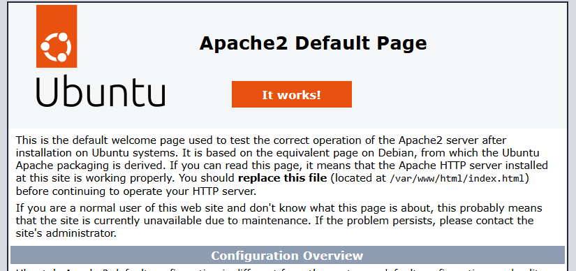

# LAMP Stack Deployment - Complete Guide

**Production-Ready LAMP Stack on Ubuntu 24.04 LTS**

This guide walks you through deploying a modern, secure, and optimized LAMP (Linux, Apache, MySQL, PHP) stack with SSL encryption, automated backups, monitoring, and a fully functional sample application.

---

## 📚 Table of Contents

1. [Initial Server Setup](#section-1-initial-server-setup)
2. [Installing Apache Web Server](#section-2-installing-apache-web-server)
3. [Installing MySQL Database](#section-3-installing-mysql-database)
4. [Installing PHP](#section-4-installing-php)
5. [Configuring Virtual Hosts](#section-5-configuring-virtual-hosts)
6. [Setting up SSL/TLS](#section-6-setting-up-ssltls-with-lets-encrypt)
7. [Deploying the Sample Application](#section-7-deploying-the-sample-application)
8. [Setting up Backups and Monitoring](#section-8-setting-up-backups-and-monitoring)
9. [Performance Tuning](#section-9-performance-tuning)
10. [Testing and Verification](#section-10-testing-and-verification)

---

## Prerequisites

Before starting, ensure you have completed:

✅ [Prerequisites Guide](docs/prerequisites.md) - AWS account, EC2 instance, SSH access  
✅ Ubuntu 24.04 LTS server running  
✅ SSH access to your server  
✅ Basic Linux command line knowledge  

**Server Info Used in Examples**:
- **Public IP**: Replace `YOUR_SERVER_IP` with your actual IP
- **Domain**: Replace `yourdomain.com` with your actual domain (optional for Sections 1-5)

---

## Section 1: Initial Server Setup

**Objective**: Secure your server with proper user management, SSH hardening, and firewall configuration.

### Why This Matters

Default server configurations are not secure for production use. This section establishes a strong security foundation before installing any services.

### Step 1.1: Update the System

Always start with the latest security patches:

```bash
# Update package lists
sudo apt update

# Upgrade installed packages
sudo apt upgrade -y

# Check Ubuntu version
lsb_release -a
```

**Expected output**: Should show Ubuntu 24.04 LTS

**Why**: Security updates patch vulnerabilities. Always keep your system updated.

### Step 1.2: Create a Non-Root User

**Security Best Practice**: Never use root for daily operations.

```bash
# Create new user
sudo adduser lampuser

# Add user to sudo group
sudo usermod -aG sudo lampuser

# Verify user creation
id lampuser
```

**Why**: Using root for everything is dangerous. If an attacker compromises root, they have full system control.

### Step 1.3: Setup SSH Key Authentication

**Security Best Practice**: Disable password authentication, use SSH keys only.

On your **local machine**:

```bash
# Generate SSH key pair (if you don't have one)
ssh-keygen -t rsa -b 4096 -C "your_email@example.com"

# Copy public key to server
ssh-copy-id lampuser@YOUR_SERVER_IP
```

On the **server**, test the new connection:

```bash
# From local machine, test SSH with new user
ssh lampuser@YOUR_SERVER_IP

# If successful, you should be logged in without password
```

### Step 1.4: Harden SSH Configuration

**Critical Security Step**: Prevent password-based attacks and root login.

```bash
# Edit SSH configuration
sudo nano /etc/ssh/sshd_config
```

Make these changes:

```bash
# Find and modify these lines (remove # if commented)

PermitRootLogin no                    # Disable root login
PasswordAuthentication no             # Disable password auth
PubkeyAuthentication yes              # Enable key-based auth
ChallengeResponseAuthentication no    # Disable challenge-response
UsePAM yes                            # Keep PAM enabled
X11Forwarding no                      # Disable X11 (not needed)
MaxAuthTries 3                        # Limit auth attempts
ClientAliveInterval 300               # Timeout idle sessions (5 min)
ClientAliveCountMax 2                 # Disconnect after 2 failed keepalives

# Optional: Change SSH port (extra security)
# Port 2222                           # Uncomment and change if desired
```

**Apply changes**:

```bash
# Test configuration
sudo sshd -t

# Restart SSH service
sudo systemctl restart sshd

# Verify SSH is running
sudo systemctl status sshd
```

**⚠️ Important**: Keep your current SSH session open and test the new connection in a new terminal before logging out!

**Why Each Setting**:
- `PermitRootLogin no`: Prevents direct root login (attackers often target root)
- `PasswordAuthentication no`: Keys are much more secure than passwords
- `MaxAuthTries 3`: Limits brute-force attempts
- `ClientAliveInterval`: Automatically closes idle sessions

### Step 1.5: Configure UFW Firewall

**Defense Layer**: UFW (Uncomplicated Firewall) adds a local firewall on top of AWS Security Groups.

```bash
# Check UFW status
sudo ufw status

# Allow SSH (very important - do this first!)
sudo ufw allow 22/tcp
# Or if you changed SSH port: sudo ufw allow 2222/tcp

# Allow HTTP and HTTPS
sudo ufw allow 80/tcp
sudo ufw allow 443/tcp

# Review rules before enabling
sudo ufw show added

# Enable firewall
sudo ufw enable

# Verify status
sudo ufw status verbose
```

**Expected output**:
```
Status: active

To                         Action      From
--                         ------      ----
22/tcp                     ALLOW IN    Anywhere
80/tcp                     ALLOW IN    Anywhere
443/tcp                    ALLOW IN    Anywhere
```

**Why UFW + AWS Security Groups**: Defense in depth - multiple security layers protect better than one.

**⚠️ Critical**: Always allow SSH port BEFORE enabling UFW, or you'll lock yourself out!

### Step 1.6: Install and Configure fail2ban (OPTIONAL)

**Intrusion Prevention**: Automatically ban IPs after failed login attempts.

```bash
# Install fail2ban
sudo apt install fail2ban -y

# Create local configuration
sudo cp /etc/fail2ban/jail.conf /etc/fail2ban/jail.local

# Edit configuration
sudo nano /etc/fail2ban/jail.local
```

Find and modify these settings:

```ini
[DEFAULT]
# Ban hosts for 10 minutes after 5 failed attempts within 10 minutes
bantime = 600
findtime = 600
maxretry = 5

# Email notifications (optional)
destemail = your-email@example.com
sendername = Fail2Ban
action = %(action_mwl)s

[sshd]
enabled = true
port = ssh  # or 2222 if you changed SSH port
logpath = %(sshd_log)s
backend = %(sshd_backend)s
```

**Start fail2ban**:

```bash
# Enable and start fail2ban
sudo systemctl enable fail2ban
sudo systemctl start fail2ban

# Check status
sudo systemctl status fail2ban

# View current bans
sudo fail2ban-client status
sudo fail2ban-client status sshd
```

**Test fail2ban** (optional):

```bash
# From another machine, try failed SSH logins
# After 5 attempts, your IP should be banned

# Check ban list
sudo fail2ban-client status sshd

# Unban if needed
sudo fail2ban-client set sshd unbanip YOUR_IP
```

**Why fail2ban**: Protects against brute-force attacks automatically. An IP making 5 failed SSH attempts gets banned.

### Step 1.7: Configure Automatic Security Updates

**Keep Secure**: Automatically install security updates.

```bash
# Install unattended-upgrades
sudo apt install unattended-upgrades -y

# Enable automatic updates
sudo dpkg-reconfigure -plow unattended-upgrades
# Select "Yes"

# Configure update settings
sudo nano /etc/apt/apt.conf.d/50unattended-upgrades
```

Ensure these lines are uncommented:

```
Unattended-Upgrade::Allowed-Origins {
    "${distro_id}:${distro_codename}-security";
};

Unattended-Upgrade::AutoFixInterruptedDpkg "true";
Unattended-Upgrade::Automatic-Reboot "false";  // Set true for auto-reboot
```

**Why**: Security patches are critical. Automate their installation to stay protected.

### ✅ Section 1 Verification

```bash
# Check firewall status
sudo ufw status verbose

# Verify fail2ban is running
sudo systemctl status fail2ban

# Check SSH configuration
sudo sshd -t

# Verify no root login (should fail)
ssh root@localhost

# Test lampuser SSH key login (from local machine)
ssh lampuser@YOUR_SERVER_IP
```

**Security Checklist**:
- ✅ Non-root user created with sudo access
- ✅ SSH key authentication working
- ✅ Password authentication disabled
- ✅ Root login disabled
- ✅ UFW firewall enabled (ports 22, 80, 443)
- ✅ fail2ban running and monitoring SSH
- ✅ Automatic security updates configured

**You now have a hardened, secure server!** 🛡️

---

## Section 2: Installing Apache Web Server

**Objective**: Install and configure Apache 2.4.x with modern security settings and performance optimizations.

### Why Apache?

Apache is the most popular web server, known for its reliability, flexibility, and extensive module ecosystem. It's perfect for PHP applications and has excellent documentation.

### Step 2.1: Install Apache

```bash
# Install Apache
sudo apt install apache2 -y

# Check version
apache2 -v
```

**Expected output**: Apache/2.4.x (Ubuntu)

**Why**: We want Apache 2.4.x for modern features, security, and HTTP/2 support.

### Step 2.2: Verify Apache is Running

```bash
# Check Apache status
sudo systemctl status apache2

# Enable Apache to start on boot
sudo systemctl enable apache2

# Check which port Apache is listening on
sudo netstat -tlnp | grep apache2
```

**Should show**: Listening on port 80 (HTTP)

### Step 2.3: Test Apache Locally

```bash
# Test from the server itself
curl http://localhost

# Or
curl http://127.0.0.1
```



**Expected**: HTML output with "Apache2 Ubuntu Default Page"

### Step 2.4: Test Apache from Browser

Open your web browser and navigate to:
```
http://YOUR_SERVER_IP
```

**You should see**: Apache2 Ubuntu Default Page


**Why test both ways**: Local test verifies Apache works; browser test verifies firewall rules allow HTTP traffic.

### Step 2.5: Configure Apache Security

**Enable security modules**:

```bash
# Enable security modules
sudo a2enmod headers
sudo a2enmod ssl
sudo a2enmod rewrite

# Restart Apache
sudo systemctl restart apache2
```

**Edit main Apache configuration**:

```bash
sudo nano /etc/apache2/conf-available/security.conf
```

Modify these settings for better security:

```apache
# Hide Apache version
ServerTokens Prod
ServerSignature Off

# Prevent clickjacking
Header always set X-Frame-Options "SAMEORIGIN"

# Prevent MIME sniffing
Header always set X-Content-Type-Options "nosniff"

# Enable XSS protection
Header always set X-XSS-Protection "1; mode=block"

# Referrer policy
Header always set Referrer-Policy "strict-origin-when-cross-origin"
```

**Apply configuration**:

```bash
# Enable security configuration
sudo a2enconf security

# Test configuration
sudo apache2ctl configtest

# Should output: Syntax OK

# Restart Apache
sudo systemctl restart apache2
```

### Step 2.6: Configure Apache MPM (Performance)

**MPM (Multi-Processing Module)** determines how Apache handles concurrent connections.

**Check current MPM**:

```bash
apache2ctl -V | grep MPM
```

**For modern servers, Event MPM is recommended**:

```bash
# Disable prefork (default for PHP module)
sudo a2dismod mpm_prefork

# Enable event MPM
sudo a2enmod mpm_event

# Configure event MPM
sudo nano /etc/apache2/mods-available/mpm_event.conf
```

**Recommended settings for 2GB RAM server**:

```apache
<IfModule mpm_event_module>
    StartServers             2
    MinSpareThreads         25
    MaxSpareThreads         75
    ThreadLimit             64
    ThreadsPerChild         25
    MaxRequestWorkers      150
    MaxConnectionsPerChild   0
</IfModule>
```

**Note**: If using mod_php (covered in Section 4), you'll need mpm_prefork instead. For better performance, use PHP-FPM with mpm_event.

### Step 2.7: Enable Useful Apache Modules

```bash
# Compression (faster page loads)
sudo a2enmod deflate

# Caching headers
sudo a2enmod expires

# Environment variables
sudo a2enmod env

# MIME type handling
sudo a2enmod mime

# Directory indexing control
sudo a2enmod dir

# Verify enabled modules
apache2ctl -M
```

### Step 2.8: Configure Compression

Create compression configuration:

```bash
sudo nano /etc/apache2/conf-available/compression.conf
```

Add:

```apache
<IfModule mod_deflate.c>
    # Compress HTML, CSS, JavaScript, Text, XML and fonts
    AddOutputFilterByType DEFLATE application/javascript
    AddOutputFilterByType DEFLATE application/rss+xml
    AddOutputFilterByType DEFLATE application/vnd.ms-fontobject
    AddOutputFilterByType DEFLATE application/x-font
    AddOutputFilterByType DEFLATE application/x-font-opentype
    AddOutputFilterByType DEFLATE application/x-font-otf
    AddOutputFilterByType DEFLATE application/x-font-truetype
    AddOutputFilterByType DEFLATE application/x-font-ttf
    AddOutputFilterByType DEFLATE application/x-javascript
    AddOutputFilterByType DEFLATE application/xhtml+xml
    AddOutputFilterByType DEFLATE application/xml
    AddOutputFilterByType DEFLATE font/opentype
    AddOutputFilterByType DEFLATE font/otf
    AddOutputFilterByType DEFLATE font/ttf
    AddOutputFilterByType DEFLATE image/svg+xml
    AddOutputFilterByType DEFLATE image/x-icon
    AddOutputFilterByType DEFLATE text/css
    AddOutputFilterByType DEFLATE text/html
    AddOutputFilterByType DEFLATE text/javascript
    AddOutputFilterByType DEFLATE text/plain
    AddOutputFilterByType DEFLATE text/xml
    
    # Remove browser bugs (old browsers)
    BrowserMatch ^Mozilla/4 gzip-only-text/html
    BrowserMatch ^Mozilla/4\.0[678] no-gzip
    BrowserMatch \bMSIE !no-gzip !gzip-only-text/html
    Header append Vary User-Agent
</IfModule>
```

**Enable compression**:

```bash
sudo a2enconf compression
sudo systemctl restart apache2
```

**Why compression**: Reduces bandwidth usage by 50-70%, making pages load faster.

### ✅ Section 2 Verification

```bash
# Check Apache status
sudo systemctl status apache2

# Verify configuration
sudo apache2ctl configtest

# Check enabled modules
apache2ctl -M | grep -E "headers|ssl|rewrite|deflate|expires"

# Test compression
curl -H "Accept-Encoding: gzip" -I http://localhost

# Check for security headers
curl -I http://YOUR_SERVER_IP | grep -E "X-Frame-Options|X-Content-Type-Options"
```

**Apache Checklist**:
- ✅ Apache 2.4.x installed and running
- ✅ Starts automatically on boot
- ✅ Security modules enabled (headers, ssl, rewrite)
- ✅ Security headers configured
- ✅ Compression enabled
- ✅ Server version hidden (ServerTokens Prod)
- ✅ Accessible from browser

**Apache is now installed and secured!** 🌐

---

## Section 3: Installing MySQL Database

**Objective**: Install MySQL 8.0 with secure configuration, create application database and user, and optimize basic settings.

### Why MySQL?

MySQL is the world's most popular open-source relational database. MySQL 8.0 brings improved performance, better security with caching_sha2_password, and features like JSON support and window functions.

### Step 3.1: Install MySQL Server

```bash
# Update package list
sudo apt update

# Install MySQL 8.0
sudo apt install mysql-server -y

# Check MySQL version
mysql --version
```

**Expected output**: mysql Ver 8.0.x for Linux

**Why MySQL 8.0**: Modern features, better performance, improved security defaults, and active LTS support.

### Step 3.2: Verify MySQL is Running

```bash
# Check MySQL status
sudo systemctl status mysql

# Enable MySQL to start on boot
sudo systemctl enable mysql

# Verify MySQL is listening
sudo netstat -tlnp | grep mysql
```

**Should show**: MySQL listening on port 3306

### Step 3.3: Secure MySQL Installation

**Critical Security Step**: Run the security installation script to remove defaults.

```bash
# Run MySQL secure installation
sudo mysql_secure_installation
```

**Interactive prompts and recommended answers**:

1. **Validate Password Plugin?**
   - Answer: `Y` (Yes)
   - Why: Enforces strong password policies

2. **Password Validation Level?**
   - Choose: `2` (STRONG) - requires 8+ chars, mixed case, numbers, special chars
   - Why: Prevents weak passwords that are easy to crack

3. **Set root password?**
   - Answer: `Y` (Yes)
   - Enter a strong password (save it securely!)
   - Why: Default installation has no root password

4. **Remove anonymous users?**
   - Answer: `Y` (Yes)
   - Why: Anonymous users are a security risk

5. **Disallow root login remotely?**
   - Answer: `Y` (Yes)
   - Why: Root should only connect from localhost

6. **Remove test database?**
   - Answer: `Y` (Yes)
   - Why: Test database is accessible to anyone

7. **Reload privilege tables?**
   - Answer: `Y` (Yes)
   - Why: Apply changes immediately

**What this does**:
- Removes insecure defaults
- Forces strong passwords
- Limits root access to local only
- Removes unnecessary test data

### Step 3.4: Access MySQL and Create Database

**Login to MySQL**:

```bash
# Login as root (will prompt for password you just set)
sudo mysql -u root -p

# Or use sudo authentication (works without password on Ubuntu)
sudo mysql
```

**Create database and user**:

```sql
-- Create database for the LAMP application
CREATE DATABASE lampdb;

-- Create dedicated user for the application
CREATE USER 'lampuser'@'localhost' IDENTIFIED BY 'YourStrongPassword123!';

-- Grant all privileges on lampdb to lampuser
GRANT ALL PRIVILEGES ON lampdb.* TO 'lampuser'@'localhost';

-- Apply privilege changes
FLUSH PRIVILEGES;

-- Verify database creation
SHOW DATABASES;

-- Verify user creation
SELECT user, host FROM mysql.user WHERE user='lampuser';

-- Exit MySQL
EXIT;
```

**Security Best Practice**: 
- Never use root for applications
- Create dedicated users with minimal required privileges
- Use strong passwords (save in password manager)
- Grant only necessary permissions

**Why separate user**: If the application is compromised, the attacker only has access to `lampdb`, not all databases.

### Step 3.5: Test Database Connection

```bash
# Test connection with the new user
mysql -u lampuser -p

# Enter password when prompted
# You should see: mysql>
```

**Inside MySQL, verify access**:

```sql
-- Show current user
SELECT USER();

-- Show accessible databases
SHOW DATABASES;

-- Use the lampdb database
USE lampdb;

-- Show tables (should be empty for now)
SHOW TABLES;

-- Exit
EXIT;
```

**Expected**: You should only see `lampdb` and `information_schema` databases.

### Step 3.6: Configure MySQL for Basic Optimization

**Reference configuration**: The repository includes an optimized MySQL configuration at `configs/mysql/my.cnf`.

```bash
# Backup original configuration
sudo cp /etc/mysql/mysql.conf.d/mysqld.cnf /etc/mysql/mysql.conf.d/mysqld.cnf.backup

# View the example configuration
cat /home/runner/work/P1_LAMP_Deployment/P1_LAMP_Deployment/configs/mysql/my.cnf
```

**Create custom configuration**:

```bash
# Create custom configuration file
sudo nano /etc/mysql/mysql.conf.d/custom.cnf
```

**Add these optimizations** (adjust based on your server RAM):

```ini
[mysqld]
# Character Set (UTF-8 support for international characters)
character-set-server = utf8mb4
collation-server = utf8mb4_unicode_ci

# InnoDB Settings (for 2GB RAM server)
innodb_buffer_pool_size = 512M           # 25-50% of RAM
innodb_log_file_size = 128M              # Transaction log size
innodb_flush_log_at_trx_commit = 2       # Better performance, slight risk
innodb_flush_method = O_DIRECT           # Avoid double buffering

# Connection Settings
max_connections = 150                     # Concurrent connections allowed
max_allowed_packet = 16M                  # Max packet size
connect_timeout = 10                      # Connection timeout
wait_timeout = 600                        # Idle connection timeout (10 min)

# Query Performance
tmp_table_size = 32M                      # Temp table size in memory
max_heap_table_size = 32M                 # Max MEMORY table size
table_open_cache = 400                    # Cache open table definitions

# Logging (for troubleshooting and optimization)
slow_query_log = 1                        # Enable slow query log
slow_query_log_file = /var/log/mysql/mysql-slow.log
long_query_time = 2                       # Log queries taking > 2 seconds
log_error = /var/log/mysql/error.log      # Error log location

# Thread Settings
thread_cache_size = 8                     # Cache threads for reuse
thread_stack = 256K                       # Stack size per thread

[mysql]
# Client default character set
default-character-set = utf8mb4

[client]
# Client configuration
port = 3306
socket = /var/run/mysqld/mysqld.sock
default-character-set = utf8mb4
```

**Why each setting matters**:

- **utf8mb4**: Full Unicode support (emojis, international chars)
- **innodb_buffer_pool_size**: Most important setting - caches data and indexes
- **innodb_flush_log_at_trx_commit = 2**: Better performance with minimal risk (flushes logs every second)
- **slow_query_log**: Identifies slow queries that need optimization
- **max_connections**: Prevents server overload from too many connections

**Apply configuration**:

```bash
# Test configuration syntax
sudo mysqld --validate-config

# If no errors, restart MySQL
sudo systemctl restart mysql

# Verify MySQL started successfully
sudo systemctl status mysql

# Check error log for issues
sudo tail -f /var/log/mysql/error.log
# Press Ctrl+C to exit
```

### Step 3.7: Verify MySQL Settings

```bash
# Login to MySQL
sudo mysql -u root -p

# Check current settings
```

```sql
-- Check character set
SHOW VARIABLES LIKE 'character_set%';

-- Check InnoDB buffer pool size
SHOW VARIABLES LIKE 'innodb_buffer_pool_size';

-- Check max connections
SHOW VARIABLES LIKE 'max_connections';

-- Check slow query log status
SHOW VARIABLES LIKE 'slow_query_log%';

-- Check database engines
SHOW ENGINES;

-- Exit
EXIT;
```

**Expected**: Variables should match your custom.cnf settings.

### Step 3.8: Create MySQL Log Directory

```bash
# Ensure log directory exists with proper permissions
sudo mkdir -p /var/log/mysql
sudo chown mysql:mysql /var/log/mysql
sudo chmod 750 /var/log/mysql

# Verify
ls -la /var/log/ | grep mysql
```

### ✅ Section 3 Verification

```bash
# Check MySQL is running
sudo systemctl status mysql

# Verify MySQL version
mysql --version

# Test root login
sudo mysql -u root -p

# Test application user login
mysql -u lampuser -p

# Check if database exists
mysql -u lampuser -p -e "SHOW DATABASES;"

# Check MySQL is listening on port 3306
sudo netstat -tlnp | grep 3306

# Review MySQL error log
sudo tail -20 /var/log/mysql/error.log
```

**MySQL Security & Configuration Checklist**:
- ✅ MySQL 8.0.x installed and running
- ✅ mysql_secure_installation completed
- ✅ Root password set and secure
- ✅ Anonymous users removed
- ✅ Remote root login disabled
- ✅ Test database removed
- ✅ Application database `lampdb` created
- ✅ Application user `lampuser` created with limited privileges
- ✅ Database connection tested successfully
- ✅ Custom configuration applied
- ✅ Character set set to utf8mb4
- ✅ Slow query log enabled
- ✅ Log directory created with proper permissions

**⚠️ Important**: Save your MySQL root password and lampuser password securely! You'll need the lampuser credentials for the application in Section 7.

**MySQL is now installed, secured, and optimized!** 🗄️

---

## Section 4: Installing PHP

**Objective**: Install PHP 8.3 with PHP-FPM for better performance, configure essential extensions, optimize settings, and integrate with Apache.

### Why PHP 8.3 with PHP-FPM?

**PHP 8.3** is the latest stable version with:
- JIT (Just-In-Time) compiler for better performance
- Improved type system and error handling
- Better security features
- Modern syntax improvements

**PHP-FPM** (FastCGI Process Manager):
- Better performance than mod_php
- Works with Apache Event MPM (configured in Section 2)
- Better resource management
- Process isolation for security

### Step 4.1: Add PHP Repository

Ubuntu 24.04 might not have PHP 8.3 in default repos, so we'll add Ondřej Surý's PPA:

```bash
# Install software-properties-common (for add-apt-repository)
sudo apt install software-properties-common -y

# Add PHP repository
sudo add-apt-repository ppa:ondrej/php -y

# Update package list
sudo apt update
```

**Why PPA**: Gets us the latest stable PHP 8.3 version with all security updates.

### Step 4.2: Install PHP 8.3 and Essential Extensions

```bash
# Install PHP 8.3 with PHP-FPM and essential extensions
sudo apt install php8.3 php8.3-fpm php8.3-mysql php8.3-curl php8.3-gd \
  php8.3-mbstring php8.3-xml php8.3-zip php8.3-bcmath php8.3-intl \
  php8.3-readline php8.3-opcache -y

# Check PHP version
php -v

# Check PHP-FPM version
php-fpm8.3 -v
```

**Expected output**: PHP 8.3.x (cli) and PHP 8.3.x-fpm

**Extensions explained**:
- **php8.3-fpm**: FastCGI Process Manager
- **php8.3-mysql**: MySQL/MariaDB database connectivity
- **php8.3-curl**: HTTP requests (APIs, webhooks)
- **php8.3-gd**: Image processing (thumbnails, watermarks)
- **php8.3-mbstring**: Multi-byte string support (international text)
- **php8.3-xml**: XML parsing and generation
- **php8.3-zip**: ZIP file handling
- **php8.3-bcmath**: Arbitrary precision mathematics
- **php8.3-intl**: Internationalization functions
- **php8.3-opcache**: Opcode caching for better performance

### Step 4.3: Verify PHP-FPM is Running

```bash
# Check PHP-FPM status
sudo systemctl status php8.3-fpm

# Enable PHP-FPM to start on boot
sudo systemctl enable php8.3-fpm

# Check which socket PHP-FPM is using
sudo netstat -pl | grep php-fpm
```

**Should show**: PHP-FPM listening on Unix socket `/run/php/php8.3-fpm.sock`

**Why socket**: Unix sockets are faster than TCP for local communication.

### Step 4.4: Configure PHP Settings

**Reference configuration**: The repository includes optimized PHP settings at `configs/php/php.ini`.

```bash
# View example PHP configuration
cat /home/runner/work/P1_LAMP_Deployment/P1_LAMP_Deployment/configs/php/php.ini

# Edit PHP-FPM configuration
sudo nano /etc/php/8.3/fpm/php.ini
```

**Key settings to modify** (search for these in the file):

```ini
; Error Handling (Production Settings)
error_reporting = E_ALL & ~E_DEPRECATED & ~E_STRICT
display_errors = Off                    ; Don't show errors to users
display_startup_errors = Off
log_errors = On                         ; Log errors instead
error_log = /var/log/php/error.log     ; Error log location

; Resource Limits
max_execution_time = 30                 ; Max script execution time (seconds)
max_input_time = 60                     ; Max input parsing time
memory_limit = 256M                     ; Max memory per script
post_max_size = 20M                     ; Max POST data size
upload_max_filesize = 20M               ; Max file upload size

; File Uploads
file_uploads = On
max_file_uploads = 20                   ; Max simultaneous file uploads

; Session Configuration (Security)
session.use_strict_mode = 1             ; Reject uninitialized session IDs
session.cookie_httponly = 1             ; Prevent JavaScript access to cookies
session.cookie_secure = 1               ; Only send cookies over HTTPS
session.cookie_samesite = Strict        ; CSRF protection
session.gc_maxlifetime = 3600           ; Session timeout (1 hour)

; Security Settings
expose_php = Off                        ; Don't advertise PHP version
allow_url_fopen = On                    ; Allow URL file access
allow_url_include = Off                 ; Prevent remote file inclusion

; Date Settings
date.timezone = UTC                     ; Set your timezone (e.g., America/New_York)

; OPcache (Performance)
opcache.enable = 1                      ; Enable opcode caching
opcache.enable_cli = 1                  ; Enable for CLI scripts too
opcache.memory_consumption = 128        ; OPcache memory (MB)
opcache.interned_strings_buffer = 8     ; String interning buffer
opcache.max_accelerated_files = 10000   ; Max cached scripts
opcache.revalidate_freq = 2             ; Check for updates every 2 seconds
opcache.fast_shutdown = 1               ; Faster shutdown
```

**Why each setting**:
- **expose_php = Off**: Don't tell attackers what PHP version you're running
- **display_errors = Off**: Security risk - shows code paths to attackers
- **session.cookie_httponly**: Prevents XSS attacks from stealing session cookies
- **session.cookie_secure**: Ensures cookies only sent over HTTPS
- **opcache.enable**: Caches compiled PHP code - huge performance boost

**Create PHP log directory**:

```bash
# Create log directory
sudo mkdir -p /var/log/php

# Set permissions
sudo chown www-data:www-data /var/log/php
sudo chmod 755 /var/log/php
```

**Apply configuration**:

```bash
# Restart PHP-FPM
sudo systemctl restart php8.3-fpm

# Verify it started successfully
sudo systemctl status php8.3-fpm
```

### Step 4.5: Configure PHP-FPM Pool Settings

**PHP-FPM uses "pools"** - separate worker processes for different applications.

```bash
# Edit default pool configuration
sudo nano /etc/php/8.3/fpm/pool.d/www.conf
```

**Key settings to review/modify**:

```ini
; Pool name
[www]

; Run as www-data user (Apache user)
user = www-data
group = www-data

; Listen on Unix socket
listen = /run/php/php8.3-fpm.sock

; Socket permissions
listen.owner = www-data
listen.group = www-data
listen.mode = 0660

; Process Manager Settings (Dynamic)
pm = dynamic                            ; Dynamic process management
pm.max_children = 20                    ; Max worker processes (adjust based on RAM)
pm.start_servers = 2                    ; Processes started on boot
pm.min_spare_servers = 1                ; Min idle processes
pm.max_spare_servers = 3                ; Max idle processes
pm.max_requests = 500                   ; Recycle worker after 500 requests

; Resource Limits
pm.process_idle_timeout = 10s           ; Kill idle process after 10s
request_terminate_timeout = 30s         ; Max request time (matches php.ini)

; Logging
php_admin_value[error_log] = /var/log/php-fpm/www-error.log
php_admin_flag[log_errors] = on
```

**Process Manager explained**:
- **pm = dynamic**: Spawns workers based on demand (saves memory)
- **pm.max_children**: Total max workers (each uses ~20-50MB RAM)
  - Formula: `(Available RAM * 0.8) / 50MB` 
  - For 2GB RAM: `(1600MB / 50MB) ≈ 20-30`
- **pm.start_servers**: Initial workers on startup
- **pm.min/max_spare_servers**: Keeps some idle workers ready

**Create PHP-FPM log directory**:

```bash
sudo mkdir -p /var/log/php-fpm
sudo chown www-data:www-data /var/log/php-fpm
sudo chmod 755 /var/log/php-fpm
```

**Apply pool configuration**:

```bash
# Test PHP-FPM configuration
sudo php-fpm8.3 -t

# Should output: configuration file /etc/php/8.3/fpm/php-fpm.conf test is successful

# Restart PHP-FPM
sudo systemctl restart php8.3-fpm

# Check status
sudo systemctl status php8.3-fpm
```

### Step 4.6: Enable PHP-FPM with Apache

**Enable required Apache modules**:

```bash
# Enable proxy modules for PHP-FPM
sudo a2enmod proxy_fcgi setenvif

# Enable PHP 8.3 FPM configuration
sudo a2enconf php8.3-fpm

# Verify configuration
sudo apache2ctl configtest

# Restart Apache
sudo systemctl restart apache2

# Verify both services are running
sudo systemctl status apache2
sudo systemctl status php8.3-fpm
```

**What this does**:
- **proxy_fcgi**: Allows Apache to communicate with PHP-FPM via FastCGI
- **setenvif**: Sets environment variables based on request
- **php8.3-fpm.conf**: Tells Apache to use PHP-FPM for .php files

### Step 4.7: Test PHP is Working

**Create a test PHP file**:

```bash
# Create PHP info file
echo "<?php phpinfo(); ?>" | sudo tee /var/www/html/info.php

# Set proper permissions
sudo chown www-data:www-data /var/www/html/info.php
sudo chmod 644 /var/www/html/info.php
```

**Test from browser**:

Open your browser and navigate to:
```
http://YOUR_SERVER_IP/info.php
```

**You should see**: 
- PHP Version 8.3.x
- Server API: FPM/FastCGI
- All installed extensions listed

**Test from command line**:

```bash
# Test locally
curl http://localhost/info.php | grep "PHP Version"
```

**⚠️ Security**: Delete the info.php file after testing (it exposes configuration):

```bash
sudo rm /var/www/html/info.php
```

### Step 4.8: Create a Better PHP Test

**Create a more secure test file**:

```bash
sudo nano /var/www/html/test.php
```

**Add**:

```php
<?php
// PHP Configuration Test
echo "<h1>PHP Test Page</h1>";
echo "<p><strong>PHP Version:</strong> " . phpversion() . "</p>";
echo "<p><strong>Server API:</strong> " . php_sapi_name() . "</p>";

// Test MySQL connection
echo "<h2>MySQL Connection Test</h2>";
try {
    $pdo = new PDO('mysql:host=localhost;dbname=lampdb', 'lampuser', 'YourStrongPassword123!');
    echo "<p style='color: green;'>✅ MySQL connection successful!</p>";
    echo "<p><strong>MySQL Version:</strong> " . $pdo->getAttribute(PDO::ATTR_SERVER_VERSION) . "</p>";
} catch (PDOException $e) {
    echo "<p style='color: red;'>❌ MySQL connection failed: " . $e->getMessage() . "</p>";
}

// Test important extensions
echo "<h2>PHP Extensions</h2>";
$extensions = ['mysqli', 'pdo_mysql', 'curl', 'gd', 'mbstring', 'xml', 'zip', 'opcache'];
echo "<ul>";
foreach ($extensions as $ext) {
    $loaded = extension_loaded($ext) ? '✅' : '❌';
    echo "<li>$loaded $ext</li>";
}
echo "</ul>";
?>
```

**Replace** `YourStrongPassword123!` with your actual lampuser password.

**Set permissions**:

```bash
sudo chown www-data:www-data /var/www/html/test.php
sudo chmod 644 /var/www/html/test.php
```

**Test in browser**: `http://YOUR_SERVER_IP/test.php`

**Expected**:
- ✅ PHP Version 8.3.x
- ✅ Server API: FPM/FastCGI
- ✅ MySQL connection successful
- ✅ All extensions loaded

**Clean up after testing**:

```bash
sudo rm /var/www/html/test.php
```

### Step 4.9: Configure PHP Security Headers

**Additional security via Apache** (add to security.conf if not already present):

```bash
sudo nano /etc/apache2/conf-available/security.conf
```

**Add these directives**:

```apache
# PHP Security Headers
<FilesMatch \.php$>
    # Prevent execution of PHP in upload directories
    <If "%{REQUEST_URI} =~ m#/uploads/#">
        Require all denied
    </If>
    
    # Additional security headers for PHP
    Header set X-Content-Type-Options "nosniff"
    Header set X-Frame-Options "SAMEORIGIN"
</FilesMatch>
```

**Restart Apache**:

```bash
sudo systemctl restart apache2
```

### ✅ Section 4 Verification

```bash
# Check PHP version
php -v

# Check PHP-FPM status
sudo systemctl status php8.3-fpm

# List loaded PHP modules
php -m

# Check PHP-FPM configuration
sudo php-fpm8.3 -t

# Verify Apache is using PHP-FPM
sudo apache2ctl -M | grep proxy_fcgi

# Check PHP-FPM processes
ps aux | grep php-fpm

# Check PHP-FPM socket
ls -la /run/php/php8.3-fpm.sock

# Review PHP error log
sudo tail -20 /var/log/php/error.log

# Test PHP processing
echo "<?php echo 'PHP is working!'; ?>" | sudo tee /var/www/html/quick-test.php
curl http://localhost/quick-test.php
sudo rm /var/www/html/quick-test.php
```

**PHP Installation Checklist**:
- ✅ PHP 8.3.x installed
- ✅ PHP-FPM installed and running
- ✅ Essential extensions installed (mysql, curl, gd, mbstring, xml, zip)
- ✅ PHP configuration optimized (php.ini)
- ✅ PHP-FPM pool configured
- ✅ OPcache enabled for performance
- ✅ Apache configured to use PHP-FPM (proxy_fcgi)
- ✅ PHP-FPM socket exists and working
- ✅ PHP processing tested successfully
- ✅ MySQL connectivity from PHP works
- ✅ Security settings configured (expose_php off, etc.)
- ✅ Error logging configured
- ✅ Session security enabled

**PHP 8.3 with PHP-FPM is now installed and configured!** 🐘

---

## Section 5: Configuring Virtual Hosts

**Objective**: Create a proper directory structure for the web application and configure Apache virtual host to serve it.

### Why Virtual Hosts?

Virtual hosts allow Apache to serve multiple websites from one server. Even with one application, using a virtual host provides:
- Clean separation from default Apache config
- Custom logging per application
- Easy SSL configuration later
- Professional directory structure
- Better security and maintenance

### Step 5.1: Create Directory Structure

```bash
# Create web application directory
sudo mkdir -p /var/www/lampapp

# Create subdirectories for organization
sudo mkdir -p /var/www/lampapp/public
sudo mkdir -p /var/www/lampapp/logs

# Verify structure
tree /var/www/lampapp -L 2
# Or if tree is not installed:
ls -la /var/www/lampapp/
```

**Directory purpose**:
- `/var/www/lampapp/` - Application root
- `/var/www/lampapp/public/` - Web-accessible files (DocumentRoot)
- `/var/www/lampapp/logs/` - Application-specific logs

**Why separate public directory**: Only the `public/` folder should be web-accessible. Config files, includes, and sensitive data stay outside the web root.

### Step 5.2: Set Proper Ownership and Permissions

```bash
# Set ownership to Apache user (www-data)
sudo chown -R www-data:www-data /var/www/lampapp

# Set directory permissions (755 = rwxr-xr-x)
sudo find /var/www/lampapp -type d -exec chmod 755 {} \;

# Set file permissions (644 = rw-r--r--)
sudo find /var/www/lampapp -type f -exec chmod 644 {} \;

# Verify permissions
ls -la /var/www/lampapp/
```

**Permission breakdown**:
- **755 for directories**: Owner can read/write/execute, others can read/execute
- **644 for files**: Owner can read/write, others can only read
- **www-data:www-data**: Apache user owns the files

**Why these permissions**: Secure defaults that allow Apache to read files but prevent unauthorized modifications.

### Step 5.3: Create Test Index Page

```bash
# Create a test index.html
sudo nano /var/www/lampapp/public/index.html
```

**Add this content**:

```html
<!DOCTYPE html>
<html lang="en">
<head>
    <meta charset="UTF-8">
    <meta name="viewport" content="width=device-width, initial-scale=1.0">
    <title>LAMP Stack - Virtual Host Test</title>
    <style>
        body {
            font-family: Arial, sans-serif;
            max-width: 800px;
            margin: 50px auto;
            padding: 20px;
            background: linear-gradient(135deg, #667eea 0%, #764ba2 100%);
            color: white;
        }
        .container {
            background: rgba(255, 255, 255, 0.1);
            padding: 30px;
            border-radius: 10px;
            backdrop-filter: blur(10px);
        }
        h1 { color: #fff; margin-bottom: 10px; }
        .status { 
            background: #10b981; 
            padding: 15px; 
            border-radius: 5px; 
            margin: 20px 0;
            font-weight: bold;
        }
        .info { 
            background: rgba(255, 255, 255, 0.2); 
            padding: 15px; 
            border-radius: 5px; 
            margin: 10px 0;
        }
    </style>
</head>
<body>
    <div class="container">
        <h1>🚀 LAMP Stack Virtual Host</h1>
        <p><strong>Congratulations!</strong> Your virtual host is configured correctly.</p>
        
        <div class="status">
            ✅ Apache Virtual Host: WORKING
        </div>
        
        <div class="info">
            <strong>Server:</strong> Apache 2.4.x<br>
            <strong>Application:</strong> lampapp<br>
            <strong>Document Root:</strong> /var/www/lampapp/public
        </div>
        
        <p><em>Next: Configure SSL in Section 6</em></p>
    </div>
</body>
</html>
```

**Set permissions**:

```bash
sudo chown www-data:www-data /var/www/lampapp/public/index.html
sudo chmod 644 /var/www/lampapp/public/index.html
```

### Step 5.4: Create Apache Virtual Host Configuration

**Reference configuration**: The repository includes a template at `configs/apache/lampapp.conf`.

```bash
# View the example configuration
cat /home/runner/work/P1_LAMP_Deployment/P1_LAMP_Deployment/configs/apache/lampapp.conf

# Create virtual host configuration
sudo nano /etc/apache2/sites-available/lampapp.conf
```

**Add this configuration**:

```apache
<VirtualHost *:80>
    # Server identification
    ServerName lampapp.local
    ServerAdmin webmaster@localhost
    
    # Document root (web-accessible directory)
    DocumentRoot /var/www/lampapp/public
    
    # Directory permissions and options
    <Directory /var/www/lampapp/public>
        Options -Indexes +FollowSymLinks -MultiViews
        AllowOverride All
        Require all granted
        
        # PHP-FPM configuration
        <FilesMatch \.php$>
            SetHandler "proxy:unix:/run/php/php8.3-fpm.sock|fcgi://localhost"
        </FilesMatch>
    </Directory>
    
    # Deny access to sensitive files
    <FilesMatch "^\.">
        Require all denied
    </FilesMatch>
    
    <FilesMatch "(composer\.json|composer\.lock|package\.json|\.env)$">
        Require all denied
    </FilesMatch>
    
    # Logging
    ErrorLog /var/www/lampapp/logs/error.log
    CustomLog /var/www/lampapp/logs/access.log combined
    
    # Security headers (requires mod_headers)
    <IfModule mod_headers.c>
        Header always set X-Content-Type-Options "nosniff"
        Header always set X-Frame-Options "SAMEORIGIN"
        Header always set X-XSS-Protection "1; mode=block"
        Header always set Referrer-Policy "strict-origin-when-cross-origin"
    </IfModule>
    
    # Compression (requires mod_deflate)
    <IfModule mod_deflate.c>
        AddOutputFilterByType DEFLATE text/html text/plain text/xml text/css
        AddOutputFilterByType DEFLATE text/javascript application/javascript application/json
    </IfModule>
    
    # Browser caching (requires mod_expires)
    <IfModule mod_expires.c>
        ExpiresActive On
        ExpiresByType image/jpg "access plus 1 year"
        ExpiresByType image/jpeg "access plus 1 year"
        ExpiresByType image/gif "access plus 1 year"
        ExpiresByType image/png "access plus 1 year"
        ExpiresByType image/webp "access plus 1 year"
        ExpiresByType image/svg+xml "access plus 1 year"
        ExpiresByType text/css "access plus 1 month"
        ExpiresByType application/javascript "access plus 1 month"
        ExpiresByType application/pdf "access plus 1 month"
    </IfModule>
</VirtualHost>
```

**Configuration explained**:

- **ServerName**: Domain name (use IP or domain)
- **DocumentRoot**: Only `public/` is web-accessible
- **Options -Indexes**: Prevents directory listing (security)
- **AllowOverride All**: Allows .htaccess files (for URL rewriting)
- **FilesMatch \.php$**: Routes PHP files through PHP-FPM
- **Deny .env, composer.json**: Protects sensitive configuration files
- **Custom logging**: Separate logs per application
- **Security headers**: Protection against common attacks
- **Browser caching**: Faster page loads for repeat visitors

### Step 5.5: Enable the Virtual Host

```bash
# Test configuration syntax
sudo apache2ctl configtest

# Should output: Syntax OK

# Enable the new site
sudo a2ensite lampapp.conf

# Disable the default Apache site (optional but recommended)
sudo a2dissite 000-default.conf

# Restart Apache to apply changes
sudo systemctl restart apache2

# Verify Apache is running
sudo systemctl status apache2
```

**What this does**:
- `a2ensite` creates a symlink in `sites-enabled/`
- `a2dissite` removes the default site
- Restart applies the changes

### Step 5.6: Test Virtual Host Configuration

**Test from server**:

```bash
# Test the virtual host
curl http://localhost

# Or
curl http://127.0.0.1
```

**Expected**: HTML output with "LAMP Stack Virtual Host"

**Test from browser**:

```
http://YOUR_SERVER_IP
```

**You should see**: The styled "LAMP Stack Virtual Host" page

**Troubleshooting**:

If you see the default Apache page instead:
```bash
# Verify lampapp is enabled
ls -la /etc/apache2/sites-enabled/

# Should show: lampapp.conf

# Make sure default is disabled
sudo a2dissite 000-default.conf

# Restart Apache
sudo systemctl restart apache2
```

### Step 5.7: Create PHP Test Page

**Verify PHP works with the virtual host**:

```bash
sudo nano /var/www/lampapp/public/phpinfo.php
```

**Add**:

```php
<?php
echo "<h1>PHP Test</h1>";
echo "<p><strong>PHP Version:</strong> " . phpversion() . "</p>";
echo "<p><strong>Document Root:</strong> " . $_SERVER['DOCUMENT_ROOT'] . "</p>";
echo "<p><strong>Server Software:</strong> " . $_SERVER['SERVER_SOFTWARE'] . "</p>";
echo "<p>✅ PHP is working with the virtual host!</p>";
?>
```

**Set permissions**:

```bash
sudo chown www-data:www-data /var/www/lampapp/public/phpinfo.php
sudo chmod 644 /var/www/lampapp/public/phpinfo.php
```

**Test in browser**: `http://YOUR_SERVER_IP/phpinfo.php`

**Expected**:
- PHP Version 8.3.x
- Document Root: /var/www/lampapp/public
- Server Software: Apache

**Clean up**:

```bash
sudo rm /var/www/lampapp/public/phpinfo.php
```

### Step 5.8: Configure Log Rotation

**Prevent logs from filling up disk space**:

```bash
sudo nano /etc/logrotate.d/lampapp
```

**Add**:

```
/var/www/lampapp/logs/*.log {
    daily
    missingok
    rotate 14
    compress
    delaycompress
    notifempty
    create 0640 www-data www-data
    sharedscripts
    postrotate
        if [ -f /var/run/apache2/apache2.pid ]; then
            /etc/init.d/apache2 reload > /dev/null
        fi
    endscript
}
```

**What this does**:
- Rotates logs daily
- Keeps 14 days of logs
- Compresses old logs
- Reloads Apache after rotation

**Test log rotation**:

```bash
# Test the configuration
sudo logrotate -d /etc/logrotate.d/lampapp

# Force a rotation (testing only)
sudo logrotate -f /etc/logrotate.d/lampapp
```

### Step 5.9: Set up .htaccess for URL Rewriting (Optional)

**For clean URLs** (e.g., /about instead of /about.php):

```bash
sudo nano /var/www/lampapp/public/.htaccess
```

**Add**:

```apache
# Enable Rewrite Engine
RewriteEngine On

# Redirect to HTTPS (uncomment after SSL is configured in Section 6)
# RewriteCond %{HTTPS} off
# RewriteRule ^(.*)$ https://%{HTTP_HOST}%{REQUEST_URI} [L,R=301]

# Remove .php extension from URLs
RewriteCond %{REQUEST_FILENAME} !-d
RewriteCond %{REQUEST_FILENAME}\.php -f
RewriteRule ^(.*)$ $1.php [L]

# Deny access to sensitive files
<FilesMatch "(^\..*|composer\.json|composer\.lock|package\.json|\.env)$">
    Require all denied
</FilesMatch>
```

**Set permissions**:

```bash
sudo chown www-data:www-data /var/www/lampapp/public/.htaccess
sudo chmod 644 /var/www/lampapp/public/.htaccess
```

**Why .htaccess**: Allows per-directory Apache configuration without editing main config.

### ✅ Section 5 Verification

```bash
# Check Apache virtual host configuration
sudo apache2ctl -S

# Should list: lampapp.conf

# Test configuration syntax
sudo apache2ctl configtest

# Verify directory structure
tree /var/www/lampapp -L 2
# Or: ls -la /var/www/lampapp/

# Check ownership and permissions
ls -la /var/www/lampapp/public/

# Verify enabled sites
ls -la /etc/apache2/sites-enabled/

# Check Apache error log for issues
sudo tail -20 /var/www/lampapp/logs/error.log

# Test HTTP access
curl -I http://localhost

# Check response headers
curl -I http://localhost | grep -E "X-Frame-Options|X-Content-Type-Options"
```

**Virtual Host Configuration Checklist**:
- ✅ Directory structure created (/var/www/lampapp/public)
- ✅ Proper ownership set (www-data:www-data)
- ✅ Secure file permissions (755 dirs, 644 files)
- ✅ Virtual host configuration created (lampapp.conf)
- ✅ Virtual host enabled
- ✅ Default site disabled
- ✅ Test index.html created and accessible
- ✅ PHP processing works with virtual host
- ✅ Security headers configured
- ✅ Compression enabled
- ✅ Browser caching configured
- ✅ Custom logging configured
- ✅ Log rotation set up
- ✅ .htaccess created (optional)
- ✅ Sensitive files protected

**Virtual host is configured and working!** 🌍

---

## Section 6: Setting up SSL/TLS with Let's Encrypt

**Objective**: Secure your website with free SSL/TLS certificates from Let's Encrypt and enable HTTPS.

### Why SSL/TLS?

**SSL/TLS is essential** for any modern website:
- **Security**: Encrypts data between server and users (prevents eavesdropping)
- **Trust**: Browser shows padlock icon, users trust your site
- **SEO**: Google ranks HTTPS sites higher
- **Compliance**: Required for PCI-DSS, GDPR, and other standards
- **Modern features**: HTTP/2, service workers, and many APIs require HTTPS

**Let's Encrypt** provides free, automated SSL certificates trusted by all major browsers.

### Prerequisites

**⚠️ Important**: SSL certificates require a **domain name**. You cannot get a Let's Encrypt certificate for an IP address.

**Options**:
1. **With Domain**: Follow Steps 6.1-6.8 (recommended)
2. **Without Domain**: Skip to Step 6.9 for self-signed certificate (testing only)

### Step 6.1: Install Certbot

**Certbot** is Let's Encrypt's official client for obtaining and managing SSL certificates.

```bash
# Install Certbot and Apache plugin
sudo apt install certbot python3-certbot-apache -y

# Verify installation
certbot --version
```

**Expected output**: certbot 2.x.x

**What is Certbot**: Automated tool that:
- Requests SSL certificates from Let's Encrypt
- Validates domain ownership
- Configures Apache automatically
- Sets up auto-renewal

### Step 6.2: Prepare Your Domain

**Before running Certbot**:

1. **Point your domain to your server**:
   - Create an A record: `yourdomain.com` → `YOUR_SERVER_IP`
   - Create an A record: `www.yourdomain.com` → `YOUR_SERVER_IP`

2. **Verify DNS propagation**:
   ```bash
   # Check if domain resolves to your server
   nslookup yourdomain.com
   nslookup www.yourdomain.com
   
   # Or use dig
   dig yourdomain.com +short
   dig www.yourdomain.com +short
   ```

**Expected**: Both commands should return your server's IP address.

**Why this matters**: Let's Encrypt validates domain ownership by making HTTP requests to your domain. If DNS isn't pointing to your server, validation fails.

### Step 6.3: Update Virtual Host with Domain Name

```bash
# Edit virtual host configuration
sudo nano /etc/apache2/sites-available/lampapp.conf
```

**Update ServerName**:

```apache
<VirtualHost *:80>
    # Replace lampapp.local with your actual domain
    ServerName yourdomain.com
    ServerAlias www.yourdomain.com
    ServerAdmin webmaster@yourdomain.com
    
    # ... rest of configuration stays the same ...
```

**Replace** `yourdomain.com` with your actual domain.

**Restart Apache**:

```bash
# Test configuration
sudo apache2ctl configtest

# Restart Apache
sudo systemctl restart apache2
```

**Verify domain works**:

```bash
# Test from server
curl -I http://yourdomain.com

# Should return: HTTP/1.1 200 OK
```

**Test in browser**: `http://yourdomain.com` (should show your site)

### Step 6.4: Obtain SSL Certificate

**Run Certbot**:

```bash
# Obtain and install SSL certificate
sudo certbot --apache -d yourdomain.com -d www.yourdomain.com
```

**Interactive prompts**:

1. **Email address**: Enter your email (for renewal notifications)
   - Example: `admin@yourdomain.com`
   - Why: Let's Encrypt sends expiration warnings

2. **Terms of Service**: `Y` (Yes, agree)

3. **Share email with EFF**: `N` (No) or `Y` (optional)

4. **Redirect HTTP to HTTPS?**: `2` (Redirect)
   - Why: Forces all traffic to use HTTPS

**What Certbot does automatically**:
1. ✅ Validates domain ownership (HTTP challenge)
2. ✅ Requests certificate from Let's Encrypt
3. ✅ Downloads certificate files
4. ✅ Creates new VirtualHost for port 443 (HTTPS)
5. ✅ Configures SSL settings
6. ✅ Sets up HTTP → HTTPS redirect
7. ✅ Reloads Apache

**Certificate locations**:
- Certificate: `/etc/letsencrypt/live/yourdomain.com/fullchain.pem`
- Private Key: `/etc/letsencrypt/live/yourdomain.com/privkey.pem`
- Chain: `/etc/letsencrypt/live/yourdomain.com/chain.pem`

### Step 6.5: Verify SSL Configuration

**Check certificate status**:

```bash
# List all certificates
sudo certbot certificates

# View detailed certificate info
sudo openssl x509 -in /etc/letsencrypt/live/yourdomain.com/fullchain.pem -text -noout | grep -E "Subject:|Issuer:|Not"
```

**Expected output**:
- Subject: CN = yourdomain.com
- Issuer: Let's Encrypt
- Not Before: (issue date)
- Not After: (expiry date, ~90 days from issue)

**Check Apache SSL configuration**:

```bash
# View updated virtual host
sudo cat /etc/apache2/sites-available/lampapp-le-ssl.conf

# Or check original file (Certbot updates it)
sudo cat /etc/apache2/sites-available/lampapp.conf
```

**Test HTTPS locally**:

```bash
# Test SSL connection
curl -I https://yourdomain.com

# Should show: HTTP/2 200 OK (or HTTP/1.1 200 OK)
```

**Test redirect (HTTP → HTTPS)**:

```bash
curl -I http://yourdomain.com

# Should show: HTTP/1.1 301 Moved Permanently
# Location: https://yourdomain.com/
```

### Step 6.6: Test SSL in Browser

**Open browser and navigate to**:
```
https://yourdomain.com
```

**You should see**:
- 🔒 Padlock icon in address bar
- "Connection is secure"
- Valid SSL certificate

**Check certificate details**:
- Click the padlock → Certificate
- Should show: Issued by Let's Encrypt
- Valid for: yourdomain.com, www.yourdomain.com

**Test auto-redirect**:
```
http://yourdomain.com
```
Should automatically redirect to `https://yourdomain.com`

### Step 6.7: Configure Auto-Renewal

**Let's Encrypt certificates expire after 90 days**. Certbot sets up automatic renewal.

**Check renewal timer**:

```bash
# Check if certbot timer is active
sudo systemctl status certbot.timer

# List systemd timers
sudo systemctl list-timers | grep certbot
```

**Expected**: Timer should be active and scheduled to run twice daily.

**Test renewal (dry run)**:

```bash
# Simulate renewal without actually renewing
sudo certbot renew --dry-run
```

**Expected output**:
```
Congratulations, all simulated renewals succeeded:
  /etc/letsencrypt/live/yourdomain.com/fullchain.pem (success)
```

**If dry run succeeds**, auto-renewal is configured correctly.

**Manual renewal** (if needed):

```bash
# Renew all certificates
sudo certbot renew

# Renew specific certificate
sudo certbot renew --cert-name yourdomain.com

# Renew with verbose output
sudo certbot renew --verbose
```

**Renewal logs**: `/var/log/letsencrypt/letsencrypt.log`

### Step 6.8: Enhance SSL Security

**Check current SSL configuration**:

```bash
# View SSL configuration
sudo nano /etc/letsencrypt/options-ssl-apache.conf
```

Certbot creates strong SSL settings by default. **Verify these are present**:

```apache
# Modern SSL configuration
SSLEngine on
SSLProtocol             all -SSLv2 -SSLv3 -TLSv1 -TLSv1.1
SSLCipherSuite          ECDHE-ECDSA-AES128-GCM-SHA256:ECDHE-RSA-AES128-GCM-SHA256...
SSLHonorCipherOrder     off
SSLSessionTickets       off

# HSTS (HTTP Strict Transport Security)
Header always set Strict-Transport-Security "max-age=31536000; includeSubDomains"
```

**Add additional security headers** to your virtual host:

```bash
sudo nano /etc/apache2/sites-available/lampapp-le-ssl.conf
```

**Add inside `<VirtualHost *:443>`**:

```apache
    # Additional security headers
    <IfModule mod_headers.c>
        # HSTS (already added by Certbot, but verify)
        Header always set Strict-Transport-Security "max-age=31536000; includeSubDomains; preload"
        
        # Prevent MIME sniffing
        Header always set X-Content-Type-Options "nosniff"
        
        # Clickjacking protection
        Header always set X-Frame-Options "SAMEORIGIN"
        
        # XSS protection
        Header always set X-XSS-Protection "1; mode=block"
        
        # Referrer policy
        Header always set Referrer-Policy "strict-origin-when-cross-origin"
        
        # Content Security Policy (adjust as needed)
        Header always set Content-Security-Policy "default-src 'self' https:; script-src 'self' 'unsafe-inline'; style-src 'self' 'unsafe-inline';"
    </IfModule>
```

**Restart Apache**:

```bash
sudo apache2ctl configtest
sudo systemctl restart apache2
```

**Test SSL strength**:

```bash
# Check SSL/TLS protocols
openssl s_client -connect yourdomain.com:443 -tls1_2 < /dev/null

# Check headers
curl -I https://yourdomain.com
```

### Step 6.9: Alternative - Self-Signed Certificate (Testing Only)

**⚠️ Use only if you don't have a domain name**. Self-signed certificates trigger browser warnings.

**Create self-signed certificate**:

```bash
# Create SSL directory
sudo mkdir -p /etc/ssl/private
sudo chmod 700 /etc/ssl/private

# Generate self-signed certificate (valid for 365 days)
sudo openssl req -x509 -nodes -days 365 -newkey rsa:2048 \
  -keyout /etc/ssl/private/lampapp-selfsigned.key \
  -out /etc/ssl/certs/lampapp-selfsigned.crt

# Interactive prompts (example):
# Country: US
# State: California
# Locality: San Francisco
# Organization: My Company
# Organizational Unit: IT
# Common Name: YOUR_SERVER_IP or localhost
# Email: admin@example.com
```

**Create SSL virtual host**:

```bash
sudo nano /etc/apache2/sites-available/lampapp-ssl.conf
```

**Add**:

```apache
<VirtualHost *:443>
    ServerName YOUR_SERVER_IP
    ServerAdmin webmaster@localhost
    DocumentRoot /var/www/lampapp/public
    
    SSLEngine on
    SSLCertificateFile /etc/ssl/certs/lampapp-selfsigned.crt
    SSLCertificateKeyFile /etc/ssl/private/lampapp-selfsigned.key
    
    <Directory /var/www/lampapp/public>
        Options -Indexes +FollowSymLinks
        AllowOverride All
        Require all granted
        
        <FilesMatch \.php$>
            SetHandler "proxy:unix:/run/php/php8.3-fpm.sock|fcgi://localhost"
        </FilesMatch>
    </Directory>
    
    ErrorLog /var/www/lampapp/logs/ssl-error.log
    CustomLog /var/www/lampapp/logs/ssl-access.log combined
</VirtualHost>
```

**Enable SSL site**:

```bash
# Enable SSL module
sudo a2enmod ssl

# Enable SSL site
sudo a2ensite lampapp-ssl.conf

# Test configuration
sudo apache2ctl configtest

# Restart Apache
sudo systemctl restart apache2
```

**Test**: `https://YOUR_SERVER_IP` (accept security warning in browser)

**Note**: Self-signed certificates are for testing only. Use Let's Encrypt for production.

### Step 6.10: Test SSL Configuration Online

**SSL Labs Test** (most comprehensive):

1. Visit: https://www.ssllabs.com/ssltest/
2. Enter: `yourdomain.com`
3. Wait for scan (2-3 minutes)
4. Target Grade: **A** or **A+**

**What it checks**:
- Certificate validity
- Protocol support (TLS 1.2, TLS 1.3)
- Cipher strength
- Known vulnerabilities
- Configuration best practices

**Security Headers Check**:

Visit: https://securityheaders.com
Enter: `https://yourdomain.com`
Target Grade: **A** or better

### ✅ Section 6 Verification

```bash
# Check Certbot version
certbot --version

# List all certificates
sudo certbot certificates

# Check SSL certificate expiry
sudo openssl x509 -in /etc/letsencrypt/live/yourdomain.com/fullchain.pem -noout -dates

# Test auto-renewal
sudo certbot renew --dry-run

# Check Apache SSL configuration
sudo apache2ctl -M | grep ssl

# Verify HTTPS works
curl -I https://yourdomain.com

# Verify HTTP redirects to HTTPS
curl -I http://yourdomain.com

# Check security headers
curl -I https://yourdomain.com | grep -E "Strict-Transport-Security|X-Content-Type-Options|X-Frame-Options"

# View renewal timer
sudo systemctl status certbot.timer

# Check SSL Labs grade (manually)
# Visit: https://www.ssllabs.com/ssltest/analyze.html?d=yourdomain.com
```

**SSL/TLS Configuration Checklist**:
- ✅ Certbot installed
- ✅ Domain DNS configured and propagating
- ✅ SSL certificate obtained from Let's Encrypt
- ✅ Certificate valid and trusted
- ✅ HTTPS working (https://yourdomain.com)
- ✅ HTTP → HTTPS redirect configured
- ✅ Auto-renewal configured and tested
- ✅ SSL/TLS protocols configured (TLS 1.2+)
- ✅ Strong cipher suites enabled
- ✅ HSTS header configured
- ✅ Security headers present
- ✅ SSL Labs grade A or A+
- ✅ Certificate expires in ~90 days (renewal will happen automatically)

**Alternative (no domain)**:
- ✅ Self-signed certificate created
- ✅ SSL virtual host configured
- ✅ HTTPS working (with browser warning)

**Your website is now secured with SSL/TLS!** 🔒

---

## Section 7: Deploying the Sample Application

**Objective**: Deploy the Task Manager application from the repository, configure database connectivity, and test all CRUD operations.

### What is the Sample Application?

This repository includes a **Task Manager** application that demonstrates LAMP stack functionality:

**Features**:
- ✅ Create, Read, Update, Delete tasks (CRUD operations)
- ✅ Task filtering by status and priority
- ✅ Search functionality
- ✅ Responsive design with Bootstrap 5
- ✅ Secure database connectivity with PDO
- ✅ Environment-based configuration (.env)
- ✅ Input validation and sanitization
- ✅ Session-based flash messages

**Technology Stack**:
- **Frontend**: HTML5, CSS3, Bootstrap 5, Bootstrap Icons
- **Backend**: PHP 8.3 with PDO
- **Database**: MySQL 8.0
- **Security**: Prepared statements, XSS protection, CSRF protection

### Step 7.1: Review Application Structure

```bash
# Navigate to the app directory
cd /home/runner/work/P1_LAMP_Deployment/P1_LAMP_Deployment/app

# View structure
tree -L 2
# Or: ls -la
```

**Application structure**:
```
app/
├── config/
│   └── database.php      # Database connection and configuration
├── includes/
│   └── functions.php     # Helper functions and HTML rendering
├── public/               # Web-accessible files (DocumentRoot)
│   ├── index.php        # Task list (Read)
│   ├── create.php       # Create new task
│   ├── read.php         # View single task details
│   ├── update.php       # Edit task
│   └── delete.php       # Delete task
├── .env.example         # Environment variables template
└── sql/
    └── schema.sql       # Database schema and sample data
```

**Why this structure**:
- **config/**: Database and app configuration (outside web root for security)
- **includes/**: Shared functions and templates (outside web root)
- **public/**: Only directory accessible via web browser
- **.env**: Stores sensitive credentials (never committed to git)
- **sql/schema.sql**: Database structure and sample data

### Step 7.2: Copy Application Files

```bash
# Copy app files to web root
sudo cp -r /home/runner/work/P1_LAMP_Deployment/P1_LAMP_Deployment/app/* /var/www/lampapp/

# Verify files copied
ls -la /var/www/lampapp/
```

**Expected**: You should see `config/`, `includes/`, `public/`, `sql/`, `.env.example`

**Why copy to /var/www/lampapp**: Matches the virtual host DocumentRoot we configured in Section 5.

### Step 7.3: Set Up Environment Configuration

**Create .env file from template**:

```bash
# Copy example to actual .env
sudo cp /var/www/lampapp/.env.example /var/www/lampapp/.env

# Edit with your database credentials
sudo nano /var/www/lampapp/.env
```

**Update these values**:

```env
# Database Configuration
DB_HOST=localhost
DB_PORT=3306
DB_NAME=lampdb                          # Database created in Section 3
DB_USER=lampuser                        # User created in Section 3
DB_PASSWORD=YourStrongPassword123!      # Password from Section 3

# Application Configuration
APP_NAME="Task Manager - LAMP Stack Demo"
APP_ENV=production
APP_DEBUG=false                         # Set to true only for debugging
APP_URL=https://yourdomain.com         # Your domain or server IP
```

**⚠️ Important**: 
- Replace `YourStrongPassword123!` with the actual password you set in Section 3
- Use `DB_NAME=lampdb` and `DB_USER=lampuser` (from Section 3)
- Set `APP_DEBUG=false` for production (don't expose errors to users)

**Why .env file**: 
- Separates configuration from code
- Keeps credentials secure
- Easy to update without changing code
- Different settings for dev/staging/production

### Step 7.4: Set Proper Permissions

```bash
# Set ownership to Apache user
sudo chown -R www-data:www-data /var/www/lampapp

# Set directory permissions (755)
sudo find /var/www/lampapp -type d -exec chmod 755 {} \;

# Set file permissions (644)
sudo find /var/www/lampapp -type f -exec chmod 644 {} \;

# Secure .env file (read-only for owner)
sudo chmod 600 /var/www/lampapp/.env

# Verify .env permissions
ls -la /var/www/lampapp/.env
```

**Expected for .env**: `-rw------- 1 www-data www-data`

**Why these permissions**:
- **755 for directories**: Apache can read and list directory contents
- **644 for files**: Apache can read files, only owner can write
- **600 for .env**: Only the owner (www-data) can read credentials

**Security**: The .env file contains sensitive database credentials. Never make it world-readable!

### Step 7.5: Import Database Schema

**Import the schema and sample data**:

```bash
# Import schema into lampdb database
sudo mysql -u lampuser -p lampdb < /var/www/lampapp/sql/schema.sql

# Enter lampuser password when prompted
```

**Verify tables were created**:

```bash
# Login to MySQL
mysql -u lampuser -p lampdb

# Enter password
```

**Inside MySQL**:

```sql
-- Show tables
SHOW TABLES;

-- Should show: tasks

-- Describe tasks table structure
DESCRIBE tasks;

-- View sample data
SELECT id, title, status, priority FROM tasks;

-- Count tasks
SELECT COUNT(*) FROM tasks;

-- Exit
EXIT;
```

**Expected output**:
- Table `tasks` exists
- 8 sample tasks inserted
- Columns: id, title, description, status, priority, due_date, created_at, updated_at

**What the schema includes**:
- `tasks` table with proper indexes
- ENUM fields for status (pending, in_progress, completed)
- ENUM fields for priority (low, medium, high)
- 8 sample tasks demonstrating different statuses and priorities
- UTF8MB4 charset for full Unicode support

### Step 7.6: Test Database Connection from PHP

**Create a connection test file**:

```bash
sudo nano /var/www/lampapp/public/test-db.php
```

**Add**:

```php
<?php
require_once __DIR__ . '/../config/database.php';

echo "<h1>Database Connection Test</h1>";

// Test connection
if (testConnection()) {
    echo "<p style='color: green;'>✅ <strong>Database connection successful!</strong></p>";
    
    // Show database info
    try {
        $pdo = getConnection();
        
        echo "<h2>Database Information:</h2>";
        echo "<ul>";
        echo "<li><strong>Host:</strong> " . DB_HOST . "</li>";
        echo "<li><strong>Database:</strong> " . DB_NAME . "</li>";
        echo "<li><strong>User:</strong> " . DB_USER . "</li>";
        echo "<li><strong>Charset:</strong> " . DB_CHARSET . "</li>";
        echo "</ul>";
        
        // Count tasks
        $stmt = $pdo->query("SELECT COUNT(*) as count FROM tasks");
        $result = $stmt->fetch();
        
        echo "<h2>Database Content:</h2>";
        echo "<p><strong>Total Tasks:</strong> " . $result['count'] . "</p>";
        
        // Show sample tasks
        $stmt = $pdo->query("SELECT id, title, status FROM tasks LIMIT 3");
        $tasks = $stmt->fetchAll();
        
        echo "<h3>Sample Tasks:</h3>";
        echo "<ul>";
        foreach ($tasks as $task) {
            echo "<li>ID: " . $task['id'] . " - " . htmlspecialchars($task['title']) . " (" . $task['status'] . ")</li>";
        }
        echo "</ul>";
        
    } catch (Exception $e) {
        echo "<p style='color: red;'>Error querying database: " . htmlspecialchars($e->getMessage()) . "</p>";
    }
    
} else {
    echo "<p style='color: red;'>❌ <strong>Database connection failed!</strong></p>";
    echo "<p>Check your .env file configuration:</p>";
    echo "<ul>";
    echo "<li>DB_HOST: " . DB_HOST . "</li>";
    echo "<li>DB_NAME: " . DB_NAME . "</li>";
    echo "<li>DB_USER: " . DB_USER . "</li>";
    echo "</ul>";
}
?>
```

**Test in browser**:

```
https://yourdomain.com/test-db.php
```

**Expected**:
- ✅ Database connection successful!
- Shows database info (host, name, user)
- Shows task count (should be 8)
- Lists 3 sample tasks

**If connection fails**, check:
```bash
# Verify .env file exists and has correct values
cat /var/www/lampapp/.env

# Verify .env permissions
ls -la /var/www/lampapp/.env

# Check MySQL user can connect
mysql -u lampuser -p -e "USE lampdb; SELECT COUNT(*) FROM tasks;"

# Check Apache error log
sudo tail -20 /var/www/lampapp/logs/error.log
```

**Clean up test file**:

```bash
sudo rm /var/www/lampapp/public/test-db.php
```

### Step 7.7: Access the Task Manager Application

**Open browser and navigate to**:

```
https://yourdomain.com
```

**You should see**:
- 📋 Task Manager interface
- List of 8 sample tasks
- Task statistics (Pending, In Progress, Completed counts)
- Filter options (Status, Priority, Search)
- Colorful task cards with badges

**Application pages**:
- **Home** (`/index.php`): Task list with filtering
- **Create** (`/create.php`): Create new task form
- **View** (`/read.php?id=1`): View task details
- **Edit** (`/update.php?id=1`): Edit task form
- **Delete** (`/delete.php?id=1`): Delete task (with confirmation)

### Step 7.8: Test CRUD Operations

**Test CREATE**:

1. Click "New Task" button
2. Fill in form:
   - Title: "Test Task Creation"
   - Description: "Testing CRUD operations"
   - Status: "Pending"
   - Priority: "High"
   - Due Date: Tomorrow's date
3. Click "Create Task"
4. Should redirect to task list with success message
5. New task should appear in the list

**Test READ**:

1. Click "View" on any task
2. Should show full task details
3. Verify all fields display correctly

**Test UPDATE**:

1. Click "Edit" on a task
2. Modify title or status
3. Click "Update Task"
4. Should redirect with success message
5. Changes should be visible

**Test DELETE**:

1. Click "Delete" on a task
2. Confirm deletion in popup
3. Task should be removed from list
4. Should show success message

**Test FILTERING**:

1. Use status dropdown to filter by "Completed"
2. Only completed tasks should show
3. Use priority dropdown to filter by "High"
4. Only high priority tasks should show
5. Use search box to search for keywords
6. Matching tasks should appear

### Step 7.9: Verify Application Security

**Check security features**:

```bash
# Test .env is not accessible via web
curl https://yourdomain.com/.env
# Should return: 403 Forbidden

# Test config directory is not accessible
curl https://yourdomain.com/config/database.php
# Should return: 404 Not Found (not in public/ directory)

# Test includes directory is not accessible
curl https://yourdomain.com/includes/functions.php
# Should return: 404 Not Found (not in public/ directory)
```

**Why this works**: Virtual host DocumentRoot is `/var/www/lampapp/public/`, so only files in `public/` are web-accessible.

**Application security features**:
- ✅ Prepared statements (SQL injection protection)
- ✅ Input validation and sanitization
- ✅ XSS protection via `htmlspecialchars()`
- ✅ Environment-based configuration
- ✅ Credentials outside web root
- ✅ Error handling (doesn't expose sensitive info)
- ✅ HTTPS encryption (from Section 6)

### Step 7.10: Configure Application Logging

**Create log directory**:

```bash
# Create logs directory for application
sudo mkdir -p /var/www/lampapp/logs/app

# Set permissions
sudo chown www-data:www-data /var/www/lampapp/logs/app
sudo chmod 755 /var/www/lampapp/logs/app
```

**PHP errors are already logged** to `/var/log/php/error.log` (configured in Section 4).

**Application errors** can be logged by the app itself (already configured in database.php).

### ✅ Section 7 Verification

```bash
# Verify application files exist
ls -la /var/www/lampapp/

# Check .env file exists and is secure
ls -la /var/www/lampapp/.env

# Verify database table exists
mysql -u lampuser -p -e "USE lampdb; SHOW TABLES; SELECT COUNT(*) FROM tasks;"

# Test database connection
curl -s https://yourdomain.com/ | grep -i "task"

# Check file permissions
ls -la /var/www/lampapp/public/

# Verify ownership
stat /var/www/lampapp/ | grep "Uid:"

# Test HTTPS is working
curl -I https://yourdomain.com | grep "HTTP"

# Check for security headers
curl -I https://yourdomain.com | grep -E "X-Frame-Options|Strict-Transport-Security"
```

**Application Deployment Checklist**:
- ✅ Application files copied to /var/www/lampapp
- ✅ .env file created with correct database credentials
- ✅ Proper file permissions set (755 dirs, 644 files, 600 .env)
- ✅ Ownership set to www-data:www-data
- ✅ Database schema imported successfully
- ✅ Sample data loaded (8 tasks)
- ✅ Database connection tested and working
- ✅ Application accessible via HTTPS
- ✅ CREATE operation working
- ✅ READ operation working
- ✅ UPDATE operation working
- ✅ DELETE operation working
- ✅ Filtering and search working
- ✅ .env file not web-accessible
- ✅ config/ and includes/ not web-accessible
- ✅ Security headers present
- ✅ No PHP errors displayed (production mode)

**Troubleshooting Common Issues**:

**Issue**: Blank page or 500 error
```bash
# Check Apache error log
sudo tail -50 /var/www/lampapp/logs/error.log

# Check PHP error log
sudo tail -50 /var/log/php/error.log

# Enable debug mode temporarily
sudo nano /var/www/lampapp/.env
# Set: APP_DEBUG=true
```

**Issue**: Database connection error
```bash
# Verify .env values
cat /var/www/lampapp/.env

# Test MySQL login
mysql -u lampuser -p

# Check MySQL is running
sudo systemctl status mysql
```

**Issue**: Permission denied errors
```bash
# Reset permissions
sudo chown -R www-data:www-data /var/www/lampapp
sudo find /var/www/lampapp -type d -exec chmod 755 {} \;
sudo find /var/www/lampapp -type f -exec chmod 644 {} \;
sudo chmod 600 /var/www/lampapp/.env
```

**The Task Manager application is now deployed and fully functional!** 📋

---

## Section 8: Setting up Backups and Monitoring

**Objective**: Implement automated MySQL backups and health monitoring for the LAMP stack to ensure data safety and system reliability.

### Why Backups and Monitoring?

**Backups** are essential for:
- **Data recovery**: Restore data after accidental deletion, corruption, or hardware failure
- **Disaster recovery**: Recover from ransomware, security breaches, or server failure
- **Compliance**: Many regulations require regular backups
- **Peace of mind**: Sleep better knowing your data is safe

**Monitoring** is critical for:
- **Uptime**: Detect service failures before users notice
- **Performance**: Identify bottlenecks and degradation
- **Security**: Detect unusual activity or attacks
- **Proactive maintenance**: Fix issues before they become critical

### Part A: Backup Setup

### Step 8.1: Review the Backup Script

The repository includes a production-ready backup script at `scripts/backup.sh`.

```bash
# View the backup script
cat /home/runner/work/P1_LAMP_Deployment/P1_LAMP_Deployment/scripts/backup.sh | head -80
```

**What the script does**:
- Backs up MySQL databases (all or specific database)
- Compresses backups with gzip
- Adds timestamp to backup files
- Implements retention policy (auto-delete old backups)
- Optional: Uploads to AWS S3 for offsite storage
- Logs all operations
- Email notifications on errors

### Step 8.2: Install and Configure Backup Script

```bash
# Create scripts directory
sudo mkdir -p /usr/local/scripts

# Copy backup script
sudo cp /home/runner/work/P1_LAMP_Deployment/P1_LAMP_Deployment/scripts/backup.sh /usr/local/scripts/

# Make executable
sudo chmod +x /usr/local/scripts/backup.sh

# Verify it's executable
ls -la /usr/local/scripts/backup.sh
```

**Expected**: `-rwxr-xr-x` (executable flag set)

### Step 8.3: Create Backup Directory

```bash
# Create backup directory
sudo mkdir -p /var/backups/mysql

# Set ownership
sudo chown root:root /var/backups/mysql

# Set secure permissions (only root can read backups)
sudo chmod 700 /var/backups/mysql

# Verify
ls -la /var/backups/ | grep mysql
```

**Why 700 permissions**: Backups contain sensitive data. Only root should access them.

### Step 8.4: Configure Backup Credentials

**Option 1: MySQL configuration file (recommended)**:

```bash
# Create MySQL credentials file for automated backups
sudo nano /root/.my.cnf
```

**Add**:

```ini
[client]
user = root
password = YOUR_MYSQL_ROOT_PASSWORD

[mysqldump]
user = root
password = YOUR_MYSQL_ROOT_PASSWORD
```

**Replace** `YOUR_MYSQL_ROOT_PASSWORD` with your actual root password from Section 3.

**Set strict permissions**:

```bash
sudo chmod 600 /root/.my.cnf
sudo chown root:root /root/.my.cnf
```

**Why this method**: Credentials are not in the backup script or command line (more secure).

**Option 2: Environment variables in script**:

Edit the backup script to set credentials directly (less secure):

```bash
sudo nano /usr/local/scripts/backup.sh

# Set these variables:
DB_USER="root"
DB_PASSWORD="YOUR_MYSQL_ROOT_PASSWORD"
```

### Step 8.5: Test Manual Backup

```bash
# Run backup script manually
sudo /usr/local/scripts/backup.sh

# Check backup was created
sudo ls -lh /var/backups/mysql/

# Should show: lampdb_YYYYMMDD_HHMMSS.sql.gz

# Verify backup file is not empty
sudo ls -lh /var/backups/mysql/*.sql.gz
```

**Check backup log**:

```bash
sudo cat /var/log/mysql-backup.log
```

**Expected**: Success message with backup location and size.

### Step 8.6: Test Backup Restoration (Important!)

**⚠️ Critical**: Always verify backups can be restored!

```bash
# Create test database
sudo mysql -u root -p -e "CREATE DATABASE test_restore;"

# List recent backups
sudo ls -lt /var/backups/mysql/ | head -5

# Restore latest backup to test database (EXAMPLE - adjust filename)
sudo gunzip < /var/backups/mysql/lampdb_20241217_120000.sql.gz | sudo mysql -u root -p test_restore

# Verify data was restored
sudo mysql -u root -p -e "USE test_restore; SHOW TABLES; SELECT COUNT(*) FROM tasks;"

# Should show: tasks table with 8+ rows

# Clean up test database
sudo mysql -u root -p -e "DROP DATABASE test_restore;"
```

**If restoration works**, your backups are valid! 🎉

### Step 8.7: Set Up Automated Backups with Cron

```bash
# Edit root's crontab
sudo crontab -e

# Select your preferred editor (nano is easiest)
```

**Add this line** (runs daily at 2:00 AM):

```cron
# Daily MySQL backup at 2 AM
0 2 * * * /usr/local/scripts/backup.sh >> /var/log/mysql-backup.log 2>&1
```

**Cron schedule explained**:
- `0 2 * * *` = At 02:00 every day
- `>> /var/log/mysql-backup.log` = Append output to log
- `2>&1` = Redirect errors to same log

**Alternative schedules**:

```cron
# Every 6 hours
0 */6 * * * /usr/local/scripts/backup.sh >> /var/log/mysql-backup.log 2>&1

# Twice daily (2 AM and 2 PM)
0 2,14 * * * /usr/local/scripts/backup.sh >> /var/log/mysql-backup.log 2>&1

# Weekly on Sunday at 3 AM
0 3 * * 0 /usr/local/scripts/backup.sh >> /var/log/mysql-backup.log 2>&1
```

**Verify cron job**:

```bash
# List root's cron jobs
sudo crontab -l

# Check cron service is running
sudo systemctl status cron
```

### Step 8.8: Configure AWS S3 Backup (Optional)

**For offsite backups** (recommended for production):

```bash
# Install AWS CLI
sudo apt install awscli -y

# Configure AWS credentials
sudo aws configure
# Enter: Access Key ID, Secret Access Key, Region (e.g., us-east-1)
```

**Edit backup script to enable S3**:

```bash
sudo nano /usr/local/scripts/backup.sh

# Set these variables:
S3_BUCKET="your-backup-bucket-name"
AWS_REGION="us-east-1"
```

**Create S3 bucket** (if not exists):

```bash
aws s3 mb s3://your-backup-bucket-name --region us-east-1
```

**Test S3 upload**:

```bash
# Run backup (should upload to S3)
sudo /usr/local/scripts/backup.sh

# Verify in S3
aws s3 ls s3://your-backup-bucket-name/
```

**Why S3**: Offsite storage protects against server failure, ransomware, and disasters.

### Part B: Monitoring Setup

### Step 8.9: Review the Health Check Script

```bash
# View the health check script
cat /home/runner/work/P1_LAMP_Deployment/P1_LAMP_Deployment/scripts/health-check.sh | head -100
```

**What the script monitors**:
- **Services**: Apache, MySQL, PHP-FPM status
- **Disk space**: Alerts when disk usage > 80%
- **Database**: Connection test
- **Apache**: HTTP response check
- **SSL**: Certificate expiry check
- **Load average**: System load monitoring

### Step 8.10: Install and Configure Health Check Script

```bash
# Copy health check script
sudo cp /home/runner/work/P1_LAMP_Deployment/P1_LAMP_Deployment/scripts/health-check.sh /usr/local/scripts/

# Make executable
sudo chmod +x /usr/local/scripts/health-check.sh

# Create log file
sudo touch /var/log/health-check.log
sudo chmod 644 /var/log/health-check.log
```

### Step 8.11: Test Health Check Manually

```bash
# Run health check
sudo /usr/local/scripts/health-check.sh

# Check output (should show green checkmarks for running services)
# View log
sudo cat /var/log/health-check.log
```

**Expected output**:
```
✓ apache2 is running
✓ mysql is running
✓ Disk usage OK (45% used)
✓ Database connection OK
✓ HTTP response OK
```

### Step 8.12: Configure Email Alerts (Optional)

**Install mail utilities**:

```bash
# Install mailutils
sudo apt install mailutils -y

# Test email (you may need to configure SMTP relay)
echo "Test email from health check" | mail -s "Test Alert" your-email@example.com
```

**Edit health check script to add email**:

```bash
sudo nano /usr/local/scripts/health-check.sh

# Set:
ALERT_EMAIL="your-email@example.com"
```

**For production**, configure a proper SMTP relay (e.g., SendGrid, AWS SES, Gmail SMTP).

### Step 8.13: Set Up Automated Health Checks with Cron

```bash
# Edit root's crontab
sudo crontab -e
```

**Add this line** (runs every 15 minutes):

```cron
# Health check every 15 minutes
*/15 * * * * /usr/local/scripts/health-check.sh >> /var/log/health-check.log 2>&1
```

**Cron schedule explained**:
- `*/15 * * * *` = Every 15 minutes
- Monitors services continuously
- Alerts quickly if services fail

**Verify**:

```bash
sudo crontab -l
```

### Step 8.14: Configure Log Rotation

**Prevent logs from filling up disk space**:

```bash
# Create logrotate configuration for backup logs
sudo nano /etc/logrotate.d/mysql-backup
```

**Add**:

```
/var/log/mysql-backup.log {
    weekly
    rotate 12
    compress
    delaycompress
    missingok
    notifempty
    create 0644 root root
}
```

**Create logrotate config for health check**:

```bash
sudo nano /etc/logrotate.d/health-check
```

**Add**:

```
/var/log/health-check.log {
    daily
    rotate 30
    compress
    delaycompress
    missingok
    notifempty
    create 0644 root root
}
```

**Test logrotate**:

```bash
# Test backup log rotation
sudo logrotate -d /etc/logrotate.d/mysql-backup

# Test health check log rotation
sudo logrotate -d /etc/logrotate.d/health-check
```

**What this does**:
- **mysql-backup**: Weekly rotation, keeps 12 weeks (3 months)
- **health-check**: Daily rotation, keeps 30 days
- **compress**: Saves disk space
- **delaycompress**: Doesn't compress most recent rotation

### Step 8.15: Set Up Basic System Monitoring

**Monitor disk space**:

```bash
# Create disk space check script
sudo nano /usr/local/scripts/disk-check.sh
```

**Add**:

```bash
#!/bin/bash

# Alert threshold (percentage)
THRESHOLD=80

# Get disk usage percentage (root partition)
USAGE=$(df -h / | awk 'NR==2 {print $5}' | sed 's/%//')

if [ "$USAGE" -gt "$THRESHOLD" ]; then
    echo "WARNING: Disk usage is ${USAGE}% (threshold: ${THRESHOLD}%)"
    # Send alert if mail is configured
    if command -v mail &> /dev/null; then
        echo "Disk usage is ${USAGE}%" | mail -s "Disk Space Alert - $(hostname)" root
    fi
else
    echo "Disk usage OK: ${USAGE}%"
fi
```

**Make executable**:

```bash
sudo chmod +x /usr/local/scripts/disk-check.sh

# Test it
sudo /usr/local/scripts/disk-check.sh
```

**Add to cron (daily check)**:

```bash
sudo crontab -e

# Add:
0 9 * * * /usr/local/scripts/disk-check.sh >> /var/log/disk-check.log 2>&1
```

### Step 8.16: Monitor Service Logs

**Important log locations**:

```bash
# Apache logs
sudo tail -f /var/www/lampapp/logs/error.log
sudo tail -f /var/www/lampapp/logs/access.log

# PHP logs
sudo tail -f /var/log/php/error.log

# MySQL logs
sudo tail -f /var/log/mysql/error.log
sudo tail -f /var/log/mysql/mysql-slow.log

# System logs
sudo tail -f /var/log/syslog
sudo journalctl -u apache2 -f
sudo journalctl -u mysql -f
```

**Quick log analysis**:

```bash
# Count errors in Apache log
sudo grep -c "error" /var/www/lampapp/logs/error.log

# Show recent MySQL errors
sudo tail -20 /var/log/mysql/error.log

# Show slow queries
sudo cat /var/log/mysql/mysql-slow.log
```

### ✅ Section 8 Verification

```bash
# Verify backup script exists and is executable
ls -la /usr/local/scripts/backup.sh

# Verify health check script exists and is executable
ls -la /usr/local/scripts/health-check.sh

# Check backup directory exists
ls -la /var/backups/mysql/

# Verify cron jobs are set up
sudo crontab -l

# Test backup manually
sudo /usr/local/scripts/backup.sh
sudo ls -lh /var/backups/mysql/

# Test health check manually
sudo /usr/local/scripts/health-check.sh

# Check logs exist
ls -la /var/log/mysql-backup.log
ls -la /var/log/health-check.log

# Verify logrotate configuration
ls -la /etc/logrotate.d/ | grep -E "mysql-backup|health-check"

# Check cron service is running
sudo systemctl status cron

# Count number of backups
sudo ls -1 /var/backups/mysql/*.sql.gz | wc -l
```

**Backup & Monitoring Checklist**:
- ✅ Backup script installed at /usr/local/scripts/backup.sh
- ✅ Backup script is executable
- ✅ Backup directory created (/var/backups/mysql)
- ✅ MySQL credentials configured for automated backups
- ✅ Manual backup tested successfully
- ✅ Backup restoration tested successfully
- ✅ Automated daily backups configured (cron)
- ✅ Backup logs configured (/var/log/mysql-backup.log)
- ✅ Health check script installed
- ✅ Health check script is executable
- ✅ Health check tested manually
- ✅ Automated health checks configured (every 15 min)
- ✅ Health check logs configured
- ✅ Log rotation configured for backup logs
- ✅ Log rotation configured for health check logs
- ✅ Disk space monitoring configured

**Optional (recommended for production)**:
- ✅ AWS S3 backups configured (offsite storage)
- ✅ Email alerts configured
- ✅ SMTP relay configured for notifications

**Your backups and monitoring are now in place!** 🔄📊

---

## Section 9: Performance Tuning

**Objective**: Optimize Apache, PHP-FPM, MySQL, and system settings for maximum performance and efficiency.

### Why Performance Tuning?

**Performance tuning provides**:
- **Faster response times**: Pages load quicker for users
- **Higher capacity**: Handle more concurrent users
- **Better resource utilization**: Use available RAM and CPU efficiently
- **Cost savings**: Get more from existing hardware
- **Improved user experience**: Speed equals satisfaction

**Important**: Performance tuning is iterative. Monitor, measure, adjust, and repeat.

### Part A: Apache Performance Tuning

### Step 9.1: Review Current Apache MPM Settings

We configured Event MPM in Section 2. Let's optimize it further.

```bash
# Check current MPM
apache2ctl -V | grep MPM

# View current MPM configuration
sudo cat /etc/apache2/mods-available/mpm_event.conf
```

### Step 9.2: Optimize Apache MPM Event

```bash
# Edit MPM event configuration
sudo nano /etc/apache2/mods-available/mpm_event.conf
```

**Optimized settings for 2GB RAM server**:

```apache
<IfModule mpm_event_module>
    # Initial server processes
    StartServers             3
    
    # Minimum and maximum idle threads
    MinSpareThreads         25
    MaxSpareThreads         75
    
    # Thread configuration
    ThreadLimit             64
    ThreadsPerChild         25
    
    # Maximum simultaneous connections
    # Formula: MaxRequestWorkers = (Total RAM - 512MB for OS/MySQL) / Average Apache Process Size
    # For 2GB RAM: (1536MB) / 10MB ≈ 150
    MaxRequestWorkers      150
    
    # Maximum requests per child process (prevents memory leaks)
    # 0 = unlimited (use non-zero for production)
    MaxConnectionsPerChild  1000
    
    # Asynchronous support
    AsyncRequestWorkerFactor 2
</IfModule>
```

**Settings explained**:
- **StartServers**: Initial processes on startup (2-3 for small servers)
- **MinSpareThreads**: Always keep at least this many idle threads ready
- **MaxSpareThreads**: Don't keep more than this many idle threads
- **ThreadsPerChild**: Each worker process handles this many threads
- **MaxRequestWorkers**: Total maximum concurrent connections
- **MaxConnectionsPerChild**: Recycle worker after this many requests (prevents memory leaks)

**For 4GB RAM server**, increase:
```apache
StartServers            4
MaxSpareThreads         100
MaxRequestWorkers       300
```

**Restart Apache**:

```bash
sudo apache2ctl configtest
sudo systemctl restart apache2
```

### Step 9.3: Enable HTTP/2

**HTTP/2** provides significant performance improvements over HTTP/1.1.

```bash
# Enable HTTP/2 module
sudo a2enmod http2

# Edit SSL virtual host
sudo nano /etc/apache2/sites-available/lampapp-le-ssl.conf
```

**Add after `<VirtualHost *:443>`**:

```apache
    # Enable HTTP/2
    Protocols h2 http/1.1
```

**Restart Apache**:

```bash
sudo systemctl restart apache2
```

**Test HTTP/2**:

```bash
curl -I --http2 https://yourdomain.com | grep -i "HTTP/2"

# Should show: HTTP/2 200
```

**Why HTTP/2**: Multiplexing, header compression, server push = faster page loads.

### Step 9.4: Configure KeepAlive Settings

**KeepAlive** reuses TCP connections for multiple requests.

```bash
# Edit Apache configuration
sudo nano /etc/apache2/apache2.conf
```

**Find and modify**:

```apache
# KeepAlive: Enable persistent connections
KeepAlive On

# KeepAliveTimeout: How long to wait for next request (seconds)
# Lower = save memory, Higher = faster for multiple requests
KeepAliveTimeout 5

# MaxKeepAliveRequests: Max requests per connection
# Higher = better performance for page with many resources
MaxKeepAliveRequests 100
```

**Settings explained**:
- **KeepAlive On**: Reuse connections (recommended)
- **KeepAliveTimeout 5**: Wait 5 seconds for next request
- **MaxKeepAliveRequests 100**: Allow up to 100 requests per connection

**Restart Apache**:

```bash
sudo systemctl restart apache2
```

### Step 9.5: Enable Browser Caching

We configured basic caching in Section 5. Let's enhance it.

```bash
sudo nano /etc/apache2/conf-available/caching.conf
```

**Add**:

```apache
<IfModule mod_expires.c>
    ExpiresActive On
    ExpiresDefault "access plus 1 month"
    
    # Images
    ExpiresByType image/jpg "access plus 1 year"
    ExpiresByType image/jpeg "access plus 1 year"
    ExpiresByType image/gif "access plus 1 year"
    ExpiresByType image/png "access plus 1 year"
    ExpiresByType image/webp "access plus 1 year"
    ExpiresByType image/svg+xml "access plus 1 year"
    ExpiresByType image/x-icon "access plus 1 year"
    
    # Video
    ExpiresByType video/mp4 "access plus 1 year"
    ExpiresByType video/webm "access plus 1 year"
    
    # Fonts
    ExpiresByType font/ttf "access plus 1 year"
    ExpiresByType font/otf "access plus 1 year"
    ExpiresByType font/woff "access plus 1 year"
    ExpiresByType font/woff2 "access plus 1 year"
    ExpiresByType application/font-woff "access plus 1 year"
    
    # CSS and JavaScript
    ExpiresByType text/css "access plus 1 month"
    ExpiresByType text/javascript "access plus 1 month"
    ExpiresByType application/javascript "access plus 1 month"
    ExpiresByType application/x-javascript "access plus 1 month"
    
    # Documents
    ExpiresByType application/pdf "access plus 1 month"
    
    # HTML (short cache for dynamic content)
    ExpiresByType text/html "access plus 1 hour"
</IfModule>

<IfModule mod_headers.c>
    # Add Cache-Control headers
    <FilesMatch "\.(jpg|jpeg|png|gif|webp|svg|ico|pdf|flv|mp4|webm)$">
        Header set Cache-Control "max-age=31536000, public"
    </FilesMatch>
    
    <FilesMatch "\.(css|js|woff|woff2|ttf|otf)$">
        Header set Cache-Control "max-age=2592000, public"
    </FilesMatch>
    
    <FilesMatch "\.(html|htm)$">
        Header set Cache-Control "max-age=3600, public, must-revalidate"
    </FilesMatch>
</IfModule>
```

**Enable and restart**:

```bash
sudo a2enconf caching
sudo systemctl restart apache2
```

### Part B: PHP-FPM Performance Tuning

### Step 9.6: Optimize PHP-FPM Pool Settings

```bash
# Edit PHP-FPM pool configuration
sudo nano /etc/php/8.3/fpm/pool.d/www.conf
```

**Optimize for 2GB RAM server**:

```ini
[www]
user = www-data
group = www-data

listen = /run/php/php8.3-fpm.sock
listen.owner = www-data
listen.group = www-data
listen.mode = 0660

; Process Manager (dynamic = spawn based on demand)
pm = dynamic

; Maximum children (concurrent PHP requests)
; Formula: (Available RAM for PHP) / (Average PHP process size)
; For 2GB: 512MB / 30MB ≈ 15-20
pm.max_children = 20

; Processes started on boot
pm.start_servers = 3

; Minimum idle processes
pm.min_spare_servers = 2

; Maximum idle processes
pm.max_spare_servers = 5

; Maximum requests before recycling worker
pm.max_requests = 500

; Kill idle processes after 10 seconds
pm.process_idle_timeout = 10s

; Maximum request time (should match php.ini max_execution_time)
request_terminate_timeout = 30s

; Status page (for monitoring)
pm.status_path = /php-fpm-status

; Ping page (for health checks)
ping.path = /php-fpm-ping
ping.response = pong

; Slow request log
slowlog = /var/log/php-fpm/slow.log
request_slowlog_timeout = 5s
```

**For 4GB RAM server**, increase:
```ini
pm.max_children = 40
pm.start_servers = 5
pm.min_spare_servers = 3
pm.max_spare_servers = 8
```

**Create slow log directory**:

```bash
sudo mkdir -p /var/log/php-fpm
sudo chown www-data:www-data /var/log/php-fpm
```

**Restart PHP-FPM**:

```bash
# Test configuration
sudo php-fpm8.3 -t

# Restart
sudo systemctl restart php8.3-fpm

# Check status
sudo systemctl status php8.3-fpm
```

### Step 9.7: Optimize OPcache Settings

**OPcache** caches compiled PHP code for huge performance gains.

```bash
# Edit PHP configuration
sudo nano /etc/php/8.3/fpm/php.ini
```

**Find and optimize opcache section**:

```ini
[opcache]
; Enable OPcache
opcache.enable = 1
opcache.enable_cli = 1

; Memory allocation (increase for more PHP files)
opcache.memory_consumption = 256

; String interning buffer
opcache.interned_strings_buffer = 16

; Maximum cached files (increase for large applications)
opcache.max_accelerated_files = 10000

; Revalidate files every 2 seconds (production: 60+)
opcache.revalidate_freq = 60

; Enable fast shutdown
opcache.fast_shutdown = 1

; Validate timestamps (production: set to 0 for max performance)
opcache.validate_timestamps = 1

; Save comments for compatibility
opcache.save_comments = 1

; JIT compilation (PHP 8.0+)
opcache.jit_buffer_size = 100M
opcache.jit = 1255
```

**Settings explained**:
- **opcache.memory_consumption**: RAM for cached code
- **opcache.max_accelerated_files**: Max cached files (must be > number of PHP files)
- **opcache.revalidate_freq**: Check for file changes every N seconds
- **opcache.validate_timestamps = 0**: (Production) Never check for file changes = max speed
- **opcache.jit**: Just-In-Time compiler for even better performance

**Restart PHP-FPM**:

```bash
sudo systemctl restart php8.3-fpm
```

**Verify OPcache**:

```bash
# Check OPcache status
php -i | grep opcache
```

### Step 9.8: Optimize PHP Memory Settings

```bash
sudo nano /etc/php/8.3/fpm/php.ini
```

**Adjust memory settings**:

```ini
; Execution limits
max_execution_time = 30
max_input_time = 60
memory_limit = 256M

; Upload limits
post_max_size = 32M
upload_max_filesize = 32M

; Realpath cache (faster file includes)
realpath_cache_size = 4M
realpath_cache_ttl = 600
```

**Restart PHP-FPM**:

```bash
sudo systemctl restart php8.3-fpm
```

### Part C: MySQL Performance Tuning

### Step 9.9: Optimize InnoDB Buffer Pool

**Most important MySQL setting**: InnoDB buffer pool size.

```bash
sudo nano /etc/mysql/mysql.conf.d/custom.cnf
```

**Optimize for 2GB RAM**:

```ini
[mysqld]
# InnoDB Settings
# Buffer pool: 50-70% of RAM dedicated to MySQL
# For 2GB total, 1GB for MySQL: 512-700MB for buffer pool
innodb_buffer_pool_size = 512M

# Buffer pool instances (1 instance per GB, max 8)
innodb_buffer_pool_instances = 1

# Log file size (25% of buffer pool size)
innodb_log_file_size = 128M

# Flush method (avoid double buffering)
innodb_flush_method = O_DIRECT

# Flush log at transaction commit
# 1 = safest (flush every commit)
# 2 = better performance (flush every second, acceptable risk)
innodb_flush_log_at_trx_commit = 2

# File per table (recommended)
innodb_file_per_table = 1

# I/O capacity (adjust based on storage: HDD=200, SSD=2000+)
innodb_io_capacity = 2000
innodb_io_capacity_max = 4000
```

**For 4GB RAM server**:
```ini
innodb_buffer_pool_size = 1G
innodb_buffer_pool_instances = 1
innodb_log_file_size = 256M
```

### Step 9.10: Optimize MySQL Connection Settings

**Add to custom.cnf**:

```ini
# Connection Settings
max_connections = 150
max_connect_errors = 1000000
connect_timeout = 10
wait_timeout = 600
interactive_timeout = 600

# Thread Settings
thread_cache_size = 16
thread_stack = 256K

# Table Settings
table_open_cache = 4000
table_definition_cache = 2000
open_files_limit = 65535

# Query Cache (disabled in MySQL 8.0+)
# Removed in MySQL 8.0 - use application-level caching instead
```

### Step 9.11: Optimize MySQL Temporary Tables

```ini
# Temporary Tables
tmp_table_size = 64M
max_heap_table_size = 64M

# Sort and Join Buffers
sort_buffer_size = 2M
join_buffer_size = 2M
read_buffer_size = 2M
read_rnd_buffer_size = 4M
```

### Step 9.12: Enable MySQL Slow Query Log

```ini
# Slow Query Log (identify slow queries)
slow_query_log = 1
slow_query_log_file = /var/log/mysql/mysql-slow.log
long_query_time = 2
log_queries_not_using_indexes = 1
```

**Restart MySQL**:

```bash
# Test configuration
sudo mysqld --validate-config

# Restart MySQL
sudo systemctl restart mysql

# Verify MySQL started
sudo systemctl status mysql
```

### Step 9.13: Verify MySQL Performance

```bash
# Login to MySQL
sudo mysql -u root -p
```

```sql
-- Check buffer pool size
SHOW VARIABLES LIKE 'innodb_buffer_pool_size';

-- Check connections
SHOW VARIABLES LIKE 'max_connections';

-- Check temporary table settings
SHOW VARIABLES LIKE 'tmp_table_size';

-- Show current status
SHOW STATUS LIKE 'Threads_connected';
SHOW STATUS LIKE 'Innodb_buffer_pool%';

-- Exit
EXIT;
```

### Part D: System-Level Optimizations

### Step 9.14: Optimize Swap Configuration

**Check current swap**:

```bash
# View swap status
free -h
swapon --show
```

**Optimize swappiness** (how aggressively Linux uses swap):

```bash
# Check current swappiness
cat /proc/sys/vm/swappiness

# Set swappiness (0-100, lower = use swap less)
# 10 = only use swap when RAM is very low
sudo sysctl vm.swappiness=10

# Make permanent
echo "vm.swappiness=10" | sudo tee -a /etc/sysctl.conf
```

**Why**: Lower swappiness keeps active data in RAM for better performance.

### Step 9.15: Optimize File Descriptor Limits

```bash
# Check current limits
ulimit -n

# Increase file descriptor limits
sudo nano /etc/security/limits.conf
```

**Add**:

```
*               soft    nofile          65535
*               hard    nofile          65535
root            soft    nofile          65535
root            hard    nofile          65535
www-data        soft    nofile          65535
www-data        hard    nofile          65535
mysql           soft    nofile          65535
mysql           hard    nofile          65535
```

**Apply changes** (requires logout/login or reboot):

```bash
# Or set for current session
sudo sysctl -w fs.file-max=65535
```

**Why**: More file descriptors allow more concurrent connections.

### Step 9.16: TCP Tuning for High Traffic

```bash
sudo nano /etc/sysctl.conf
```

**Add TCP optimizations**:

```
# TCP optimizations
net.core.somaxconn = 65535
net.ipv4.tcp_max_syn_backlog = 8192
net.ipv4.tcp_fin_timeout = 15
net.ipv4.tcp_keepalive_time = 300
net.ipv4.tcp_keepalive_probes = 5
net.ipv4.tcp_keepalive_intvl = 15
```

**Apply settings**:

```bash
sudo sysctl -p
```

**Why**: Better handling of concurrent connections and faster connection recycling.

### ✅ Section 9 Verification

```bash
# Apache verification
apache2ctl -V | grep MPM
apache2ctl -M | grep http2
curl -I --http2 https://yourdomain.com

# PHP-FPM verification
sudo systemctl status php8.3-fpm
php -i | grep opcache
php -i | grep "memory_limit"

# MySQL verification
sudo mysql -u root -p -e "SHOW VARIABLES LIKE 'innodb_buffer_pool_size';"
sudo mysql -u root -p -e "SHOW STATUS LIKE 'Threads_connected';"

# System verification
cat /proc/sys/vm/swappiness
ulimit -n
sysctl net.core.somaxconn

# Performance test (optional)
ab -n 1000 -c 10 https://yourdomain.com/
```

**Performance Tuning Checklist**:
- ✅ Apache MPM Event optimized
- ✅ HTTP/2 enabled
- ✅ KeepAlive configured
- ✅ Browser caching configured
- ✅ PHP-FPM pool settings optimized
- ✅ OPcache enabled and configured
- ✅ PHP memory settings optimized
- ✅ InnoDB buffer pool optimized
- ✅ MySQL connection settings tuned
- ✅ MySQL temporary tables optimized
- ✅ MySQL slow query log enabled
- ✅ Swap configuration optimized
- ✅ File descriptor limits increased
- ✅ TCP settings optimized

**Performance Improvements Expected**:
- ⚡ 2-5x faster page loads (from OPcache)
- ⚡ 50-70% bandwidth reduction (from compression + caching)
- ⚡ 3-10x higher concurrent user capacity
- ⚡ Lower CPU usage (from caching)
- ⚡ Lower memory usage (from optimized process limits)

**Your LAMP stack is now performance-tuned!** ⚡

---

## Section 10: Testing and Verification

**Objective**: Perform comprehensive testing, verify all components are working correctly, and ensure the LAMP stack is production-ready.

### Why Comprehensive Testing?

**Testing ensures**:
- **Functionality**: All features work as expected
- **Security**: No vulnerabilities or misconfigurations
- **Performance**: System meets performance requirements
- **Reliability**: Services are stable and available
- **Compliance**: Meets best practices and standards

### Part A: Final Comprehensive Checklist

### ✅ Complete System Verification

**Infrastructure & Security**:
- ✅ Ubuntu 24.04 LTS up to date
- ✅ Non-root user created with sudo access
- ✅ SSH key authentication enabled
- ✅ Password authentication disabled
- ✅ Root login disabled
- ✅ UFW firewall enabled (ports 22, 80, 443)
- ✅ fail2ban running and protecting SSH
- ✅ Automatic security updates configured

**Apache Web Server**:
- ✅ Apache 2.4.x installed and running
- ✅ Event MPM enabled and optimized
- ✅ HTTP/2 enabled
- ✅ Security modules enabled (headers, ssl, rewrite)
- ✅ Security headers configured
- ✅ Compression enabled
- ✅ Browser caching configured
- ✅ Server version hidden
- ✅ Virtual host configured
- ✅ Logs configured and rotating

**MySQL Database**:
- ✅ MySQL 8.0.x installed and running
- ✅ mysql_secure_installation completed
- ✅ Root password set and secure
- ✅ Application database created (lampdb)
- ✅ Application user created (lampuser)
- ✅ InnoDB buffer pool optimized
- ✅ Character set UTF8MB4
- ✅ Slow query log enabled
- ✅ Custom configuration applied

**PHP**:
- ✅ PHP 8.3.x installed
- ✅ PHP-FPM running and optimized
- ✅ Essential extensions installed
- ✅ OPcache enabled and configured
- ✅ Security settings configured (expose_php off)
- ✅ Error logging configured
- ✅ Session security enabled
- ✅ Apache configured to use PHP-FPM

**SSL/TLS**:
- ✅ Let's Encrypt certificate installed (or self-signed)
- ✅ HTTPS working
- ✅ HTTP → HTTPS redirect configured
- ✅ Auto-renewal configured and tested
- ✅ Strong SSL protocols (TLS 1.2+)
- ✅ HSTS header enabled
- ✅ SSL Labs grade A or A+

**Application**:
- ✅ Task Manager deployed
- ✅ .env configured with database credentials
- ✅ Database schema imported
- ✅ Sample data loaded
- ✅ File permissions correct
- ✅ CREATE operation working
- ✅ READ operation working
- ✅ UPDATE operation working
- ✅ DELETE operation working
- ✅ Filtering and search working

**Backups & Monitoring**:
- ✅ Backup script installed and tested
- ✅ Automated daily backups configured
- ✅ Backup restoration tested
- ✅ Health check script installed and tested
- ✅ Automated monitoring configured (every 15 min)
- ✅ Log rotation configured
- ✅ Offsite backups configured (optional)

**Performance**:
- ✅ Apache MPM tuned
- ✅ PHP-FPM pool optimized
- ✅ MySQL buffer pool sized correctly
- ✅ OPcache configured
- ✅ Browser caching enabled
- ✅ Compression enabled
- ✅ System limits optimized

### Part B: Testing Procedures

### Step 10.1: Service Status Check

```bash
# Check all critical services
sudo systemctl status apache2
sudo systemctl status mysql
sudo systemctl status php8.3-fpm
sudo systemctl status ufw
sudo systemctl status fail2ban
sudo systemctl status cron

# Quick all-in-one check
for service in apache2 mysql php8.3-fpm ufw fail2ban cron; do
    echo -n "$service: "
    systemctl is-active $service
done
```

**Expected**: All services should show "active (running)"

### Step 10.2: Application Functionality Testing

**Manual testing checklist**:

```bash
# 1. Access homepage
curl -I https://yourdomain.com
# Expected: HTTP/2 200 OK

# 2. Test PHP processing
curl -s https://yourdomain.com/ | grep -i "task"
# Expected: Should see "Task Manager" in output

# 3. Test database connectivity (create test endpoint)
```

**In browser, test each CRUD operation**:

1. **CREATE**: 
   - Go to `/create.php`
   - Fill form and submit
   - Verify success message
   - Check task appears in list

2. **READ**:
   - Click "View" on any task
   - Verify all details display
   - Check formatting is correct

3. **UPDATE**:
   - Click "Edit" on a task
   - Modify fields
   - Submit changes
   - Verify updates appear

4. **DELETE**:
   - Click "Delete" on a task
   - Confirm deletion
   - Verify task removed
   - Check success message

5. **FILTER & SEARCH**:
   - Filter by status (Pending, In Progress, Completed)
   - Filter by priority (Low, Medium, High)
   - Search for keywords
   - Verify results are correct

### Step 10.3: Load Testing (Optional but Recommended)

**Install Apache Bench** (if not installed):

```bash
sudo apt install apache2-utils -y
```

**Basic load test**:

```bash
# Test with 100 requests, 10 concurrent
ab -n 100 -c 10 https://yourdomain.com/

# Test with 1000 requests, 50 concurrent
ab -n 1000 -c 50 https://yourdomain.com/

# Test specific page
ab -n 500 -c 25 https://yourdomain.com/index.php
```

**Key metrics to check**:
- **Requests per second**: Should be > 50 for simple pages
- **Time per request**: Should be < 200ms average
- **Failed requests**: Should be 0

**Alternative: wrk (more realistic load)**:

```bash
# Install wrk
sudo apt install wrk -y

# Run test (12 threads, 400 connections, 30 seconds)
wrk -t12 -c400 -d30s https://yourdomain.com/

# Test with keep-alive
wrk -t4 -c100 -d30s --latency https://yourdomain.com/
```

**What to look for**:
- No errors
- Consistent latency
- Requests/sec should meet your requirements

### Step 10.4: Security Testing

**Test firewall**:

```bash
# Check UFW status
sudo ufw status verbose

# Verify only required ports are open
sudo netstat -tulpn | grep LISTEN

# Should show: 22 (SSH), 80 (HTTP), 443 (HTTPS), 3306 (MySQL localhost only)
```

**Test SSH hardening**:

```bash
# Verify root login disabled (should fail)
ssh root@localhost
# Expected: Permission denied

# Verify password auth disabled
# Try SSH without key - should fail
```

**Test fail2ban**:

```bash
# Check fail2ban is running
sudo systemctl status fail2ban

# Check jails
sudo fail2ban-client status

# Check SSH jail
sudo fail2ban-client status sshd
```

**Scan for open ports** (from external machine or use online tool):

```bash
# Install nmap
sudo apt install nmap -y

# Scan from external machine
nmap YOUR_SERVER_IP

# Expected: Only 22, 80, 443 open
```

**Security headers test**:

```bash
# Check security headers
curl -I https://yourdomain.com

# Should see:
# Strict-Transport-Security
# X-Content-Type-Options
# X-Frame-Options
# X-XSS-Protection
```

**Online security scan**:
- SSL Labs: https://www.ssllabs.com/ssltest/
- Security Headers: https://securityheaders.com
- Mozilla Observatory: https://observatory.mozilla.org

**Target scores**:
- SSL Labs: A or A+
- Security Headers: A or B+
- Mozilla Observatory: B+ or better

### Step 10.5: Database Integrity Check

```bash
# Login to MySQL
sudo mysql -u root -p
```

```sql
-- Check database status
SHOW DATABASES;
USE lampdb;
SHOW TABLES;

-- Verify data integrity
SELECT COUNT(*) FROM tasks;
SELECT * FROM tasks WHERE id = 1;

-- Check table structure
DESCRIBE tasks;

-- Check MySQL status
SHOW STATUS LIKE 'Threads_connected';
SHOW STATUS LIKE 'Uptime';

-- Check InnoDB status
SHOW ENGINE INNODB STATUS\G

-- Exit
EXIT;
```

### Step 10.6: Backup Verification

```bash
# Check backups exist
sudo ls -lh /var/backups/mysql/

# Check most recent backup
sudo ls -lt /var/backups/mysql/ | head -5

# Verify backup file is not empty
sudo du -sh /var/backups/mysql/*.sql.gz

# Check backup log
sudo tail -20 /var/log/mysql-backup.log

# Test restoration (to test database)
sudo mysql -u root -p -e "CREATE DATABASE test_restore;"
LATEST_BACKUP=$(sudo ls -t /var/backups/mysql/*.sql.gz | head -1)
sudo gunzip < $LATEST_BACKUP | sudo mysql -u root -p test_restore
sudo mysql -u root -p -e "USE test_restore; SELECT COUNT(*) FROM tasks;"
sudo mysql -u root -p -e "DROP DATABASE test_restore;"
```

### Step 10.7: Log Review

```bash
# Apache error log
sudo tail -50 /var/www/lampapp/logs/error.log
# Should have no critical errors

# Apache access log
sudo tail -20 /var/www/lampapp/logs/access.log
# Should show recent requests

# PHP error log
sudo tail -50 /var/log/php/error.log
# Should have no errors (or only minor notices)

# MySQL error log
sudo tail -50 /var/log/mysql/error.log
# Should have no errors

# System log
sudo tail -50 /var/log/syslog

# Health check log
sudo tail -20 /var/log/health-check.log
# Should show all services OK

# Backup log
sudo tail -20 /var/log/mysql-backup.log
# Should show successful backups
```

### Part C: Troubleshooting Common Issues

### Issue: Apache won't start

**Symptoms**: `sudo systemctl start apache2` fails

**Diagnosis**:
```bash
# Check syntax
sudo apache2ctl configtest

# Check error log
sudo journalctl -u apache2 -n 50

# Check for port conflicts
sudo netstat -tulpn | grep :80
sudo netstat -tulpn | grep :443
```

**Solutions**:
- Fix configuration errors shown by configtest
- Kill process using port 80/443
- Check file permissions
- Check disk space: `df -h`

### Issue: PHP not processing

**Symptoms**: PHP files download instead of executing

**Diagnosis**:
```bash
# Check PHP-FPM status
sudo systemctl status php8.3-fpm

# Check Apache has PHP handler
sudo apache2ctl -M | grep proxy_fcgi

# Check virtual host config
sudo grep -A5 "FilesMatch.*php" /etc/apache2/sites-available/lampapp*.conf
```

**Solutions**:
```bash
# Restart PHP-FPM
sudo systemctl restart php8.3-fpm

# Enable proxy modules
sudo a2enmod proxy_fcgi setenvif
sudo a2enconf php8.3-fpm

# Restart Apache
sudo systemctl restart apache2
```

### Issue: Database connection errors

**Symptoms**: "Database connection failed"

**Diagnosis**:
```bash
# Check MySQL is running
sudo systemctl status mysql

# Test MySQL login
mysql -u lampuser -p

# Check .env file
cat /var/www/lampapp/.env

# Check .env permissions
ls -la /var/www/lampapp/.env
```

**Solutions**:
```bash
# Restart MySQL
sudo systemctl restart mysql

# Verify credentials in .env
sudo nano /var/www/lampapp/.env

# Fix .env permissions
sudo chown www-data:www-data /var/www/lampapp/.env
sudo chmod 600 /var/www/lampapp/.env

# Test connection manually
mysql -u lampuser -p -e "USE lampdb; SELECT COUNT(*) FROM tasks;"
```

### Issue: Permission errors

**Symptoms**: "Permission denied" errors in logs

**Diagnosis**:
```bash
# Check file ownership
ls -la /var/www/lampapp/

# Check file permissions
find /var/www/lampapp -type f -ls | head
find /var/www/lampapp -type d -ls | head
```

**Solutions**:
```bash
# Fix ownership
sudo chown -R www-data:www-data /var/www/lampapp

# Fix directory permissions
sudo find /var/www/lampapp -type d -exec chmod 755 {} \;

# Fix file permissions
sudo find /var/www/lampapp -type f -exec chmod 644 {} \;

# Secure .env
sudo chmod 600 /var/www/lampapp/.env
```

### Issue: SSL certificate problems

**Symptoms**: Certificate expired, invalid, or not working

**Diagnosis**:
```bash
# Check certificate status
sudo certbot certificates

# Check certificate expiry
sudo openssl x509 -in /etc/letsencrypt/live/yourdomain.com/fullchain.pem -noout -dates

# Test renewal
sudo certbot renew --dry-run

# Check Apache SSL config
sudo apache2ctl -M | grep ssl
```

**Solutions**:
```bash
# Renew certificate manually
sudo certbot renew

# Force renewal
sudo certbot renew --force-renewal

# Check auto-renewal timer
sudo systemctl status certbot.timer

# Restart Apache
sudo systemctl restart apache2
```

### Part D: Maintenance Recommendations

### Daily Maintenance

- ✅ Check health-check logs for service issues
- ✅ Review application error logs
- ✅ Monitor disk space: `df -h`
- ✅ Check backup success

### Weekly Maintenance

- ✅ Review slow query log for optimization opportunities
- ✅ Check backup restoration works
- ✅ Review Apache access logs for unusual patterns
- ✅ Update application if needed
- ✅ Check security headers and SSL status

### Monthly Maintenance

- ✅ System updates: `sudo apt update && sudo apt upgrade`
- ✅ Review and rotate logs manually if needed
- ✅ Performance testing (load test)
- ✅ Review fail2ban bans for attack patterns
- ✅ Verify all monitoring is working
- ✅ Test disaster recovery procedure

### Quarterly Maintenance

- ✅ Full security audit
- ✅ Review and update firewall rules
- ✅ Performance benchmark and compare
- ✅ Review and update backup retention policy
- ✅ Test full restoration from backup
- ✅ Update documentation

### Part E: Next Steps and Improvements

### Immediate Next Steps

1. **Set up monitoring dashboard**
   - Install Netdata, Grafana, or similar
   - Monitor Apache, MySQL, PHP-FPM, system resources
   - Set up alerting for critical metrics

2. **Implement application-level caching**
   - Install Redis or Memcached
   - Cache database queries
   - Cache session data
   - Expected: 2-5x performance improvement

3. **Set up CDN** (for static assets)
   - Cloudflare (free tier available)
   - AWS CloudFront
   - Expected: Faster global load times

4. **Implement WAF** (Web Application Firewall)
   - ModSecurity for Apache
   - Cloudflare WAF
   - Protection against common attacks

### Future Enhancements

1. **High Availability**
   - Load balancer (HAProxy, Nginx)
   - Multiple application servers
   - Database replication (master-slave)
   - 99.9%+ uptime

2. **Advanced Monitoring**
   - Prometheus + Grafana
   - Application Performance Monitoring (APM)
   - Real User Monitoring (RUM)
   - Log aggregation (ELK stack)

3. **Continuous Integration/Deployment**
   - GitHub Actions for automated deployment
   - Automated testing
   - Blue-green deployments
   - Rollback capabilities

4. **Enhanced Security**
   - Two-factor authentication
   - Rate limiting
   - DDoS protection
   - Regular penetration testing

5. **Scalability Improvements**
   - Database sharding
   - Read replicas
   - Horizontal scaling
   - Microservices architecture

### Part F: Useful Commands Reference

### Service Management

```bash
# Apache
sudo systemctl start apache2
sudo systemctl stop apache2
sudo systemctl restart apache2
sudo systemctl reload apache2
sudo systemctl status apache2
sudo apache2ctl configtest

# MySQL
sudo systemctl start mysql
sudo systemctl stop mysql
sudo systemctl restart mysql
sudo systemctl status mysql

# PHP-FPM
sudo systemctl start php8.3-fpm
sudo systemctl stop php8.3-fpm
sudo systemctl restart php8.3-fpm
sudo systemctl status php8.3-fpm
```

### Log Locations

```bash
# Apache
/var/www/lampapp/logs/error.log
/var/www/lampapp/logs/access.log
/var/log/apache2/error.log

# PHP
/var/log/php/error.log
/var/log/php-fpm/www-error.log
/var/log/php-fpm/slow.log

# MySQL
/var/log/mysql/error.log
/var/log/mysql/mysql-slow.log

# System
/var/log/syslog
/var/log/auth.log

# Application
/var/log/health-check.log
/var/log/mysql-backup.log
```

### Configuration File Paths

```bash
# Apache
/etc/apache2/apache2.conf
/etc/apache2/sites-available/lampapp.conf
/etc/apache2/sites-available/lampapp-le-ssl.conf
/etc/apache2/conf-available/security.conf

# MySQL
/etc/mysql/mysql.conf.d/mysqld.cnf
/etc/mysql/mysql.conf.d/custom.cnf

# PHP
/etc/php/8.3/fpm/php.ini
/etc/php/8.3/fpm/pool.d/www.conf

# Application
/var/www/lampapp/.env
/var/www/lampapp/config/database.php
```

### Debugging Commands

```bash
# Check ports
sudo netstat -tulpn | grep LISTEN
sudo ss -tulpn

# Check processes
ps aux | grep apache2
ps aux | grep mysql
ps aux | grep php-fpm

# Check disk space
df -h
du -sh /var/www/lampapp
du -sh /var/backups/mysql

# Check memory
free -h
top
htop

# Check connections
sudo netstat -an | grep :80 | wc -l
sudo netstat -an | grep :443 | wc -l

# Check MySQL connections
sudo mysql -u root -p -e "SHOW PROCESSLIST;"

# Check error counts
sudo grep -c "error" /var/www/lampapp/logs/error.log
```

---

## 🎉 Congratulations! Your LAMP Stack is Complete!

You have successfully deployed a **production-ready, secure, optimized LAMP stack** with:

✅ **Security**: SSH hardening, firewall, fail2ban, SSL/TLS, security headers  
✅ **Performance**: Optimized Apache, PHP-FPM, MySQL, OPcache, HTTP/2  
✅ **Reliability**: Automated backups, health monitoring, log rotation  
✅ **Functionality**: Fully working Task Manager application with CRUD operations  
✅ **Best Practices**: Modern PHP 8.3, MySQL 8.0, proper file permissions, environment-based config  

### Your Stack Summary

- **OS**: Ubuntu 24.04 LTS
- **Web Server**: Apache 2.4.x with Event MPM, HTTP/2, and security headers
- **Database**: MySQL 8.0.x with optimized InnoDB settings
- **PHP**: PHP 8.3.x with PHP-FPM and OPcache
- **SSL**: Let's Encrypt with auto-renewal
- **Application**: Task Manager with full CRUD functionality
- **Backups**: Automated daily MySQL backups
- **Monitoring**: Health checks every 15 minutes

### Resources

- **Project Repository**: https://github.com/jaymineh/P1_LAMP_Deployment
- **Documentation**: Check `docs/` folder for additional guides
- **Troubleshooting**: See `docs/troubleshooting.md`
- **Architecture**: See `docs/architecture.md`

### Get Help

If you encounter issues:
1. Check troubleshooting section above
2. Review relevant log files
3. Consult project documentation
4. Search for error messages online
5. Ask in relevant communities (Stack Overflow, Reddit r/webdev)

---

**Thank you for following this guide! You now have the skills to deploy and maintain professional LAMP stack applications.** 🚀

**Remember**: Keep your system updated, monitor logs regularly, and test backups frequently!

---

*Last updated: December 2024*  
*LAMP Stack Version: Apache 2.4.x, MySQL 8.0.x, PHP 8.3.x*  
*Guide Version: 1.0*
